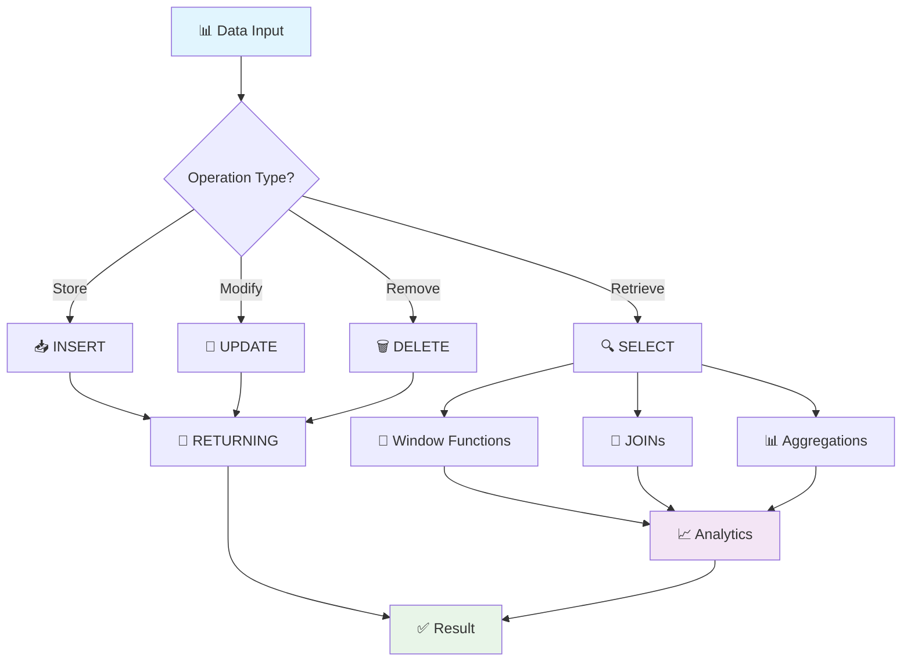

# 🚀 Powerful SQL Commands for Backend/AI Engineers

## 📖 Overview
Основа основ! Для ML Platform Engineer'а знание мощных SQL команд = способность эффективно работать с feature stores, метриками моделей и большими датасетами. Поехали! 🔥

## 🛠️ Core Data Operations

### 📥 INSERT: Storing Data Like a Pro

```sql
-- 🎯 Basic INSERT
INSERT INTO tracks (title, artist, genre, embedding) 
VALUES ('Lose Yourself', 'Eminem', 'Hip-Hop', '[0.1, 0.2, ...]');

-- 🚀 Bulk INSERT (для AI datasets!)
INSERT INTO model_metrics (model_id, accuracy, precision, recall, created_at)
VALUES 
  ('gpt-4', 0.95, 0.92, 0.88, NOW()),
  ('claude-3', 0.93, 0.90, 0.85, NOW()),
  ('llama-2', 0.87, 0.84, 0.82, NOW());

-- 💪 INSERT with RETURNING (получаем ID сразу!)
INSERT INTO experiments (name, config)
VALUES ('rap_analyzer_v2', '{"model": "gpt-4", "temperature": 0.1}')
RETURNING id, created_at;

-- 🔄 UPSERT (INSERT ON CONFLICT) - идеально для feature updates!
INSERT INTO user_preferences (user_id, genre_weights)
VALUES (123, '{"hip-hop": 0.8, "pop": 0.2}')
ON CONFLICT (user_id) 
DO UPDATE SET 
  genre_weights = EXCLUDED.genre_weights,
  updated_at = NOW();
```

### 🔄 UPDATE: Smart Data Modifications

```sql
-- 🎯 Basic UPDATE
UPDATE tracks 
SET play_count = play_count + 1 
WHERE id = 12345;

-- 🧠 Conditional UPDATE (для AI модели states)
UPDATE ml_models 
SET 
  status = CASE 
    WHEN accuracy > 0.9 THEN 'production'
    WHEN accuracy > 0.8 THEN 'staging'
    ELSE 'development'
  END,
  last_evaluated = NOW()
WHERE model_type = 'sentiment_analyzer';

-- 🔗 UPDATE with JOIN (обновляем через связанные таблицы)
UPDATE tracks t
SET popularity_score = s.avg_rating
FROM (
  SELECT track_id, AVG(rating) as avg_rating
  FROM user_ratings 
  GROUP BY track_id
) s
WHERE t.id = s.track_id;

-- 📊 UPDATE с подзапросом для ML features
UPDATE user_profiles 
SET recommended_genres = (
  SELECT array_agg(genre)
  FROM user_listening_history ulh
  WHERE ulh.user_id = user_profiles.id
  GROUP BY user_id
  ORDER BY COUNT(*) DESC
  LIMIT 3
);
```

### 🗑️ DELETE: Clean Data Management

```sql
-- 🎯 Basic DELETE
DELETE FROM old_experiments 
WHERE created_at < NOW() - INTERVAL '30 days';

-- 🧹 DELETE with subquery (удаляем неактивные модели)
DELETE FROM model_artifacts 
WHERE model_id IN (
  SELECT id FROM ml_models 
  WHERE status = 'deprecated' 
  AND last_used < NOW() - INTERVAL '90 days'
);

-- 📊 DELETE with RETURNING (логируем что удалили)
DELETE FROM failed_predictions 
WHERE confidence_score < 0.1
RETURNING model_id, COUNT(*) as deleted_count;
```

## 🔍 Advanced SELECT Patterns

### 🎨 Window Functions (мощь для аналитики!)

```sql
-- 📈 Ranking models by performance
SELECT 
  model_name,
  accuracy,
  ROW_NUMBER() OVER (ORDER BY accuracy DESC) as rank,
  LAG(accuracy) OVER (ORDER BY accuracy DESC) as prev_accuracy,
  accuracy - LAG(accuracy) OVER (ORDER BY accuracy DESC) as improvement
FROM model_performance
ORDER BY accuracy DESC;

-- 📊 Running totals для метрик
SELECT 
  date_trunc('day', created_at) as day,
  COUNT(*) as daily_predictions,
  SUM(COUNT(*)) OVER (ORDER BY date_trunc('day', created_at)) as cumulative_predictions
FROM predictions
WHERE created_at >= NOW() - INTERVAL '30 days'
GROUP BY date_trunc('day', created_at)
ORDER BY day;
```

### 🔗 Advanced JOINs

```sql
-- 🎭 Comprehensive JOIN для AI pipeline
SELECT 
  t.title,
  t.artist,
  a.sentiment_score,
  a.emotion_categories,
  u.listening_frequency,
  m.model_confidence
FROM tracks t
LEFT JOIN ai_analysis a ON t.id = a.track_id
INNER JOIN user_listening u ON t.id = u.track_id
LEFT JOIN model_predictions m ON a.id = m.analysis_id
WHERE u.user_id = $1
  AND a.created_at >= NOW() - INTERVAL '7 days';
```

## 🎯 Specialized Commands for AI/Backend

### 📊 Aggregations for ML Metrics

```sql
-- 🧮 Model performance aggregation
SELECT 
  model_name,
  COUNT(*) as total_predictions,
  AVG(confidence_score) as avg_confidence,
  STDDEV(confidence_score) as confidence_std,
  PERCENTILE_CONT(0.95) WITHIN GROUP (ORDER BY confidence_score) as p95_confidence,
  COUNT(*) FILTER (WHERE actual_result = predicted_result) / COUNT(*)::float as accuracy
FROM model_predictions
WHERE created_at >= NOW() - INTERVAL '24 hours'
GROUP BY model_name
ORDER BY accuracy DESC;
```

### 🔍 Complex Filtering for Feature Engineering

```sql
-- 🎨 Feature selection query
WITH user_behavior AS (
  SELECT 
    user_id,
    genre,
    COUNT(*) as listen_count,
    AVG(duration_seconds) as avg_duration,
    COUNT(*) FILTER (WHERE rating >= 4) as liked_tracks
  FROM listening_history
  WHERE created_at >= NOW() - INTERVAL '30 days'
  GROUP BY user_id, genre
),
user_preferences AS (
  SELECT 
    user_id,
    array_agg(genre ORDER BY listen_count DESC) as preferred_genres,
    SUM(listen_count) as total_listens
  FROM user_behavior
  GROUP BY user_id
)
SELECT 
  up.user_id,
  up.preferred_genres[1:3] as top_genres,
  up.total_listens,
  CASE 
    WHEN up.total_listens > 1000 THEN 'heavy_user'
    WHEN up.total_listens > 100 THEN 'regular_user'
    ELSE 'light_user'
  END as user_segment
FROM user_preferences up
WHERE up.total_listens > 50;
```

## 🎯 Performance Commands

### 📈 Query Optimization

```sql
-- 🔍 EXPLAIN ANALYZE для оптимизации
EXPLAIN (ANALYZE, BUFFERS, FORMAT JSON) 
SELECT * FROM tracks 
WHERE embedding <-> '[0.1, 0.2, ...]' < 0.5
ORDER BY embedding <-> '[0.1, 0.2, ...]'
LIMIT 10;

-- 📊 Index usage check
SELECT 
  schemaname,
  tablename,
  indexname,
  idx_scan,
  idx_tup_read,
  idx_tup_fetch
FROM pg_stat_user_indexes
WHERE idx_scan < 100
ORDER BY idx_scan;
```

## 🚀 Pro Tips для AI/Backend Engineers

### 💡 Best Practices

1. **🎯 Always use parameterized queries**: `WHERE user_id = $1` вместо string concatenation
2. **📊 Use RETURNING**: Получай данные сразу после INSERT/UPDATE
3. **🔄 Batch operations**: GROUP BY и window functions вместо N+1 queries
4. **📈 Monitor performance**: EXPLAIN ANALYZE - твой лучший друг
5. **🛡️ Use transactions**: BEGIN/COMMIT для data consistency

### ⚡ Performance Hacks

```sql
-- 🚀 Efficient pagination
SELECT * FROM tracks
WHERE id > 1000  -- вместо OFFSET
ORDER BY id
LIMIT 20;

-- 📊 Efficient counting
SELECT reltuples::bigint as estimate
FROM pg_class
WHERE relname = 'tracks';  -- быстрее чем COUNT(*)
```

## 🎨 Mermaid: SQL Command Flow



Бро, это база для любого Backend/AI Engineer'а! 🔥 С такими командами ты сможешь эффективно работать с feature stores, моделировать ML pipeline'ы и оптимизировать запросы для production систем. Твой rap analyzer уже использует многие из этих паттернов! 🎤✨
