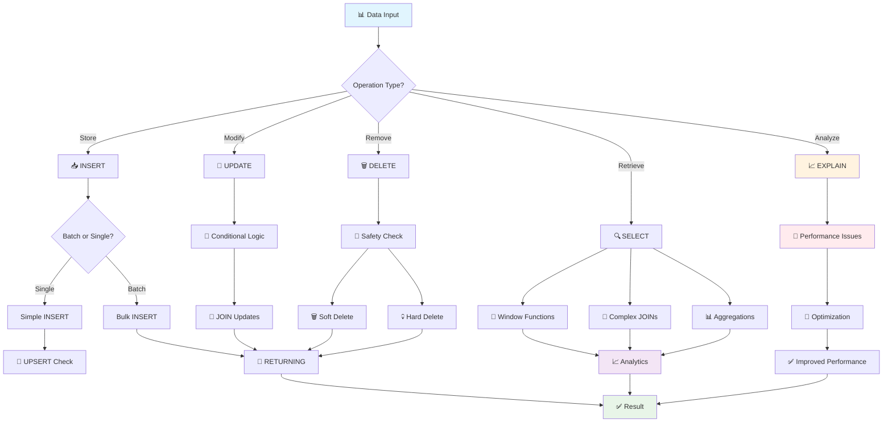

# 🚀 Powerful SQL Commands for Backend/AI Engineers

## 📖 Overview
Основа основ! Для ML Platform Engineer'а знание мощных SQL команд = способность эффективно работать с feature stores, метриками моделей и большими датасетами. Поехали! 🔥

## 🛠️ Core Data Operations

### 📥 INSERT: Storing Data Like a Pro

<details>
<summary>📥 <strong>INSERT операции - от базы до продакшена</strong></summary>

```sql
-- 🎯 Basic INSERT - простая вставка одной записи
INSERT INTO users (name, email, role) 
VALUES ('John Doe', 'john@example.com', 'analyst');

-- 🚀 Bulk INSERT (для AI datasets!) - массовая загрузка данных
INSERT INTO model_metrics (model_id, accuracy, precision, recall, created_at)
VALUES 
  ('gpt-4', 0.95, 0.92, 0.88, NOW()),      -- GPT-4 метрики
  ('claude-3', 0.93, 0.90, 0.85, NOW()),   -- Claude метрики
  ('llama-2', 0.87, 0.84, 0.82, NOW());    -- LLaMA метрики
-- 💡 Bulk INSERT в 10-100 раз быстрее отдельных INSERT'ов!

-- 💪 INSERT with RETURNING (получаем ID сразу!)
INSERT INTO experiments (name, config)
VALUES ('sentiment_analysis_v2', '{"model": "bert", "epochs": 10}')
RETURNING id, created_at;
-- 🎯 Возвращает: id=123, created_at=2025-01-15 14:30:00
-- 💡 Избегаем дополнительный SELECT для получения ID!

-- 🔄 UPSERT (INSERT ON CONFLICT) - идеально для feature updates!
INSERT INTO user_features (user_id, feature_vector, last_computed)
VALUES (12345, '[0.1, 0.2, 0.8]', NOW())
ON CONFLICT (user_id)           -- если user_id уже существует
DO UPDATE SET 
  feature_vector = EXCLUDED.feature_vector,    -- обновляем вектор
  last_computed = NOW(),                       -- и время
  update_count = COALESCE(update_count, 0) + 1; -- считаем обновления
-- 🎯 Либо создает новую запись, либо обновляет существующую!
```

**🚨 Red Flags для INSERT:**
- Много отдельных INSERT вместо bulk операций
- Отсутствие транзакций для связанных данных
- Игнорирование RETURNING когда нужен ID

</details>

### 🔄 UPDATE: Smart Data Modifications

<details>
<summary>🔄 <strong>UPDATE операции - умные обновления данных</strong></summary>

```sql
-- 🎯 Basic UPDATE - простое обновление
UPDATE user_sessions 
SET last_activity = NOW()           -- обновляем время активности
WHERE session_id = 'abc123'         -- для конкретной сессии
  AND status = 'active';            -- только если сессия активна

-- 🧠 Conditional UPDATE (для AI модели states)
UPDATE ml_models 
SET 
  status = CASE                     -- условное обновление статуса
    WHEN accuracy > 0.95 THEN 'production'     -- высокая точность -> продакшен
    WHEN accuracy > 0.85 THEN 'staging'        -- средняя -> тестирование  
    WHEN accuracy > 0.70 THEN 'development'    -- низкая -> разработка
    ELSE 'failed'                              -- совсем плохо -> провал
  END,
  last_evaluated = NOW(),           -- время последней оценки
  deployment_ready = (accuracy > 0.90)  -- готовность к деплою
WHERE model_type = 'text_classifier'     -- только для текстовых классификаторов
  AND created_at >= NOW() - INTERVAL '7 days';  -- недавно созданные

-- 🔗 UPDATE with JOIN (обновляем через связанные таблицы)
UPDATE products p
SET category_popularity = c.avg_rating    -- обновляем популярность категории
FROM (
  SELECT 
    category_id,
    AVG(rating) as avg_rating,          -- средний рейтинг по категории
    COUNT(*) as review_count            -- количество отзывов
  FROM product_reviews 
  WHERE created_at >= NOW() - INTERVAL '30 days'  -- за последний месяц
  GROUP BY category_id
  HAVING COUNT(*) >= 10                 -- минимум 10 отзывов
) c
WHERE p.category_id = c.category_id;    -- связываем продукты с категориями

-- 📊 UPDATE с подзапросом для ML features
UPDATE user_profiles 
SET 
  top_categories = (                    -- топ категории пользователя
    SELECT array_agg(category ORDER BY interaction_count DESC)
    FROM user_interactions ui
    WHERE ui.user_id = user_profiles.user_id
      AND ui.created_at >= NOW() - INTERVAL '90 days'  -- за 3 месяца
    GROUP BY user_id
    LIMIT 5                             -- топ-5 категорий
  ),
  activity_score = (                    -- скор активности
    SELECT COUNT(*) * 1.0 / EXTRACT(days FROM NOW() - MIN(created_at))
    FROM user_interactions ui2
    WHERE ui2.user_id = user_profiles.user_id
  )
WHERE last_updated < NOW() - INTERVAL '24 hours';  -- обновляем раз в день
```

**🚨 Red Flags для UPDATE:**
- UPDATE без WHERE (обновит ВСЕ записи!)
- Отсутствие индексов на WHERE условиях
- UPDATE в цикле вместо batch операции

</details>

### 🗑️ DELETE: Clean Data Management

<details>
<summary>🗑️ <strong>DELETE операции - умная очистка данных</strong></summary>

```sql
-- 🎯 Basic DELETE - простое удаление старых данных
DELETE FROM system_logs 
WHERE created_at < NOW() - INTERVAL '90 days'    -- старше 90 дней
  AND log_level NOT IN ('ERROR', 'CRITICAL');    -- кроме ошибок

-- 🧹 DELETE with subquery (удаляем связанные неактивные записи)
DELETE FROM model_artifacts 
WHERE model_id IN (
  SELECT m.id FROM ml_models m
  WHERE m.status = 'deprecated'                   -- устаревшие модели
    AND m.last_used < NOW() - INTERVAL '180 days' -- не использовались полгода
    AND NOT EXISTS (                              -- нет активных предсказаний
      SELECT 1 FROM predictions p 
      WHERE p.model_id = m.id 
        AND p.created_at >= NOW() - INTERVAL '30 days'
    )
);

-- 📊 DELETE with RETURNING (логируем что удалили)
DELETE FROM failed_predictions 
WHERE confidence_score < 0.1              -- очень низкая уверенность
  AND created_at < NOW() - INTERVAL '7 days'  -- старше недели
RETURNING 
  model_id, 
  COUNT(*) as deleted_count,              -- количество удаленных
  AVG(confidence_score) as avg_confidence;  -- средняя уверенность удаленных

-- 🔄 Soft DELETE (помечаем как удаленные, не удаляем физически)
UPDATE user_accounts 
SET 
  deleted_at = NOW(),                     -- помечаем время удаления
  email = 'deleted_' || id || '@deleted.com',  -- анонимизируем email
  status = 'deleted'
WHERE user_id = $1                        -- конкретный пользователь
  AND deleted_at IS NULL;                 -- еще не удален
```

**🚨 Red Flags для DELETE:**
- DELETE без WHERE (удалит ВСЮ таблицу!)
- Каскадное удаление без проверки связей
- Отсутствие бэкапа перед массовым удалением

</details>

## 🔍 Advanced SELECT Patterns

### 🎨 Window Functions (мощь для аналитики!)

<details>
<summary>🎨 <strong>Window Functions - аналитика на стероидах</strong></summary>

```sql
-- 📈 Ranking models by performance
SELECT 
  model_name,
  accuracy,
  -- 🏆 Ранжирование моделей по точности
  ROW_NUMBER() OVER (ORDER BY accuracy DESC) as rank,
  -- 📊 Сравнение с предыдущей моделью по рангу
  LAG(accuracy) OVER (ORDER BY accuracy DESC) as prev_accuracy,
  -- 📈 Насколько лучше предыдущей модели
  accuracy - LAG(accuracy) OVER (ORDER BY accuracy DESC) as improvement,
  -- 🎯 Процентиль производительности
  PERCENT_RANK() OVER (ORDER BY accuracy) * 100 as percentile
FROM model_performance
WHERE evaluated_at >= NOW() - INTERVAL '30 days'  -- последний месяц
ORDER BY accuracy DESC;

-- 📊 Running totals для метрик (кумулятивная статистика)
SELECT 
  date_trunc('day', created_at) as day,
  COUNT(*) as daily_predictions,           -- предсказаний за день
  -- 📈 Кумулятивная сумма предсказаний
  SUM(COUNT(*)) OVER (
    ORDER BY date_trunc('day', created_at)
  ) as cumulative_predictions,
  -- 📊 Скользящее среднее за 7 дней
  AVG(COUNT(*)) OVER (
    ORDER BY date_trunc('day', created_at)
    ROWS BETWEEN 6 PRECEDING AND CURRENT ROW
  ) as moving_avg_7_days,
  -- 🎯 Процентное изменение к предыдущему дню
  (COUNT(*) - LAG(COUNT(*)) OVER (ORDER BY date_trunc('day', created_at))) 
  / LAG(COUNT(*)) OVER (ORDER BY date_trunc('day', created_at))::float * 100 as daily_change_percent
FROM predictions
WHERE created_at >= NOW() - INTERVAL '60 days'
GROUP BY date_trunc('day', created_at)
ORDER BY day;

-- 🏷️ Partitioned ranking (ранжирование внутри групп)
SELECT 
  category,
  product_name,
  sales_amount,
  -- 🏆 Ранг внутри категории
  RANK() OVER (PARTITION BY category ORDER BY sales_amount DESC) as category_rank,
  -- 📊 Процент от общих продаж категории
  sales_amount / SUM(sales_amount) OVER (PARTITION BY category) * 100 as category_percent,
  -- 🎯 Топ-3 в категории?
  CASE 
    WHEN RANK() OVER (PARTITION BY category ORDER BY sales_amount DESC) <= 3 
    THEN 'Top 3' 
    ELSE 'Other' 
  END as performance_tier
FROM product_sales
WHERE sale_date >= NOW() - INTERVAL '30 days';
```

**💡 Объяснение Window Functions:**
- `OVER()` - определяет "окно" для расчета
- `PARTITION BY` - делит данные на группы
- `ORDER BY` - сортировка внутри окна
- `ROWS/RANGE` - границы окна для расчета

</details>

### 🔗 Advanced JOINs

<details>
<summary>🔗 <strong>Advanced JOIN операции - связываем данные эффективно</strong></summary>

```sql
-- 🎭 Comprehensive JOIN для полной картины данных
SELECT 
  u.user_id,
  u.email,
  u.registration_date,
  -- 📊 Данные профиля пользователя  
  p.age_group,
  p.location,
  -- 🤖 AI анализ поведения
  a.sentiment_score,
  a.engagement_level,
  a.predicted_churn_probability,
  -- 📈 Метрики активности
  s.total_sessions,
  s.avg_session_duration,
  s.last_activity,
  -- 💰 Данные подписки
  sub.plan_type,
  sub.monthly_revenue,
  sub.subscription_status
FROM users u
-- 👤 Профиль может отсутствовать у новых пользователей
LEFT JOIN user_profiles p ON u.user_id = p.user_id
-- 🤖 AI анализ только у активных пользователей  
LEFT JOIN ai_user_analysis a ON u.user_id = a.user_id 
  AND a.analysis_date >= NOW() - INTERVAL '7 days'
-- 📊 Сессии агрегируются на лету
LEFT JOIN (
  SELECT 
    user_id,
    COUNT(*) as total_sessions,
    AVG(duration_seconds) as avg_session_duration,
    MAX(created_at) as last_activity
  FROM user_sessions 
  WHERE created_at >= NOW() - INTERVAL '30 days'
  GROUP BY user_id
) s ON u.user_id = s.user_id
-- 💳 Подписка должна быть активной
INNER JOIN subscriptions sub ON u.user_id = sub.user_id 
  AND sub.status = 'active'
WHERE u.created_at >= NOW() - INTERVAL '90 days'  -- новые пользователи
  AND u.email_verified = true                     -- верифицированные
ORDER BY s.last_activity DESC NULLS LAST;

-- 🔄 Self JOIN для иерархических данных
SELECT 
  c.category_id,
  c.category_name,
  c.parent_id,
  -- 📊 Родительская категория
  parent.category_name as parent_category,
  -- 🏷️ Полный путь категории
  COALESCE(parent.category_name || ' > ', '') || c.category_name as full_path,
  -- 📈 Количество подкategорий
  (SELECT COUNT(*) FROM categories children 
   WHERE children.parent_id = c.category_id) as subcategories_count
FROM categories c
-- 🔗 Self JOIN для получения родительской категории
LEFT JOIN categories parent ON c.parent_id = parent.category_id
WHERE c.is_active = true
ORDER BY full_path;

-- 💡 LATERAL JOIN для сложной логики
SELECT 
  u.user_id,
  u.email,
  -- 🎯 Топ-3 недавние покупки для каждого пользователя
  recent_orders.product_names,
  recent_orders.total_amount,
  recent_orders.order_count
FROM users u
-- 📦 LATERAL позволяет ссылаться на u.user_id в подзапросе
LEFT JOIN LATERAL (
  SELECT 
    array_agg(p.product_name ORDER BY o.created_at DESC) as product_names,
    SUM(o.total_amount) as total_amount,
    COUNT(*) as order_count
  FROM orders o
  JOIN order_items oi ON o.order_id = oi.order_id
  JOIN products p ON oi.product_id = p.product_id
  WHERE o.user_id = u.user_id                    -- ссылка на внешнюю таблицу!
    AND o.created_at >= NOW() - INTERVAL '30 days'
  LIMIT 3
) recent_orders ON true
WHERE u.status = 'active';
```

**🚨 Red Flags для JOIN:**
- CROSS JOIN без WHERE (декартово произведение!)
- JOIN без индексов на ключах связи
- Множественные LEFT JOIN без необходимости

</details>

## 🎯 Specialized Commands for AI/Backend

### 📊 Aggregations for ML Metrics

<details>
<summary>📊 <strong>ML Aggregations - статистика для моделей</strong></summary>

```sql
-- 🧮 Model performance aggregation - полная статистика моделей
SELECT 
  model_name,
  model_version,
  -- 📊 Базовые метрики
  COUNT(*) as total_predictions,
  COUNT(*) FILTER (WHERE prediction_time < 100) as fast_predictions,  -- < 100ms
  -- 🎯 Статистика уверенности
  AVG(confidence_score) as avg_confidence,
  STDDEV(confidence_score) as confidence_std,
  MIN(confidence_score) as min_confidence,
  MAX(confidence_score) as max_confidence,
  -- 📈 Перцентили производительности
  PERCENTILE_CONT(0.50) WITHIN GROUP (ORDER BY confidence_score) as median_confidence,
  PERCENTILE_CONT(0.95) WITHIN GROUP (ORDER BY confidence_score) as p95_confidence,
  PERCENTILE_CONT(0.99) WITHIN GROUP (ORDER BY confidence_score) as p99_confidence,
  -- ✅ Точность модели (если есть ground truth)
  COUNT(*) FILTER (WHERE actual_result = predicted_result) / COUNT(*)::float as accuracy,
  -- ⚡ Производительность
  AVG(prediction_time_ms) as avg_prediction_time,
  PERCENTILE_CONT(0.95) WITHIN GROUP (ORDER BY prediction_time_ms) as p95_prediction_time,
  -- 📅 Временные паттерны
  COUNT(*) FILTER (WHERE created_at >= NOW() - INTERVAL '1 hour') as predictions_last_hour,
  COUNT(*) FILTER (WHERE created_at >= NOW() - INTERVAL '24 hours') as predictions_last_day
FROM model_predictions
WHERE created_at >= NOW() - INTERVAL '7 days'    -- последняя неделя
GROUP BY model_name, model_version
HAVING COUNT(*) >= 100                           -- минимум 100 предсказаний
ORDER BY accuracy DESC, avg_confidence DESC;

-- 📊 User behavior aggregation для recommendation систем  
SELECT 
  user_id,
  -- 🎭 Поведенческие паттерны
  COUNT(DISTINCT session_date) as active_days,
  COUNT(*) as total_interactions,
  AVG(session_duration_minutes) as avg_session_duration,
  -- 🏷️ Предпочтения по категориям
  array_agg(DISTINCT category ORDER BY interaction_count DESC) 
    FILTER (WHERE category_rank <= 3) as top_categories,
  -- 📈 Временные паттерны
  COUNT(*) FILTER (WHERE EXTRACT(hour FROM created_at) BETWEEN 9 AND 17) as business_hours_interactions,
  COUNT(*) FILTER (WHERE EXTRACT(dow FROM created_at) IN (0,6)) as weekend_interactions,
  -- 🎯 Engagement метрики
  AVG(rating) FILTER (WHERE rating IS NOT NULL) as avg_rating,
  COUNT(*) FILTER (WHERE interaction_type = 'like') as likes_count,
  COUNT(*) FILTER (WHERE interaction_type = 'share') as shares_count,
  -- 💡 ML features для модели
  CASE 
    WHEN COUNT(*) > 1000 THEN 'power_user'
    WHEN COUNT(*) > 100 THEN 'regular_user'  
    ELSE 'casual_user'
  END as user_segment
FROM (
  -- 🔄 Подготовка данных с ранжированием категорий
  SELECT 
    ui.*,
    DATE(ui.created_at) as session_date,
    COUNT(*) OVER (PARTITION BY ui.user_id, ui.category) as interaction_count,
    ROW_NUMBER() OVER (PARTITION BY ui.user_id ORDER BY COUNT(*) DESC) as category_rank
  FROM user_interactions ui
  WHERE ui.created_at >= NOW() - INTERVAL '90 days'
) user_stats
GROUP BY user_id
ORDER BY total_interactions DESC;
```

**💡 Полезные функции для ML:**
- `FILTER (WHERE ...)` - условная агрегация
- `PERCENTILE_CONT()` - точные перцентили
- `STDDEV()` - стандартное отклонение
- `array_agg()` - агрегация в массив

</details>

### 🔍 Complex Filtering for Feature Engineering

<details>
<summary>🔍 <strong>Feature Engineering - создание признаков для ML</strong></summary>

```sql
-- 🎨 Feature selection query - комплексная подготовка признаков
WITH user_behavior AS (
  -- 📊 Агрегация поведения пользователя по категориям
  SELECT 
    user_id,
    category,
    COUNT(*) as interaction_count,           -- количество взаимодействий
    AVG(session_duration_minutes) as avg_duration,  -- средняя длительность
    COUNT(*) FILTER (WHERE rating >= 4) as positive_interactions,  -- позитивные
    MAX(created_at) as last_interaction,     -- последнее взаимодействие
    -- 📈 Временные признаки
    COUNT(*) FILTER (WHERE EXTRACT(hour FROM created_at) < 12) as morning_interactions,
    COUNT(*) FILTER (WHERE EXTRACT(dow FROM created_at) IN (0,6)) as weekend_interactions
  FROM user_interactions
  WHERE created_at >= NOW() - INTERVAL '60 days'   -- последние 2 месяца
  GROUP BY user_id, category
),
user_preferences AS (
  -- 🏷️ Обработка предпочтений пользователя
  SELECT 
    user_id,
    -- 🎯 Топ категории по убыванию активности
    array_agg(category ORDER BY interaction_count DESC) as preferred_categories,
    -- 📊 Общая статистика
    SUM(interaction_count) as total_interactions,
    AVG(avg_duration) as overall_avg_duration,
    SUM(positive_interactions) as total_positive,
    MAX(last_interaction) as most_recent_activity,
    -- 💡 Признаки разнообразия
    COUNT(DISTINCT category) as categories_explored,
    -- 🕐 Временные паттерны
    SUM(morning_interactions) / SUM(interaction_count)::float as morning_ratio,
    SUM(weekend_interactions) / SUM(interaction_count)::float as weekend_ratio
  FROM user_behavior
  GROUP BY user_id
  HAVING SUM(interaction_count) >= 10        -- минимум 10 взаимодействий
),
user_segments AS (
  -- 🎭 Сегментация пользователей
  SELECT 
    *,
    -- 🏆 Уровень активности
    CASE 
      WHEN total_interactions >= 500 THEN 'power_user'
      WHEN total_interactions >= 100 THEN 'regular_user'
      WHEN total_interactions >= 20 THEN 'casual_user'
      ELSE 'new_user'
    END as activity_segment,
    -- 🎨 Тип поведения
    CASE 
      WHEN categories_explored >= 10 THEN 'explorer'
      WHEN total_positive / total_interactions::float > 0.8 THEN 'enthusiast'
      WHEN weekend_ratio > 0.6 THEN 'weekend_warrior'
      WHEN morning_ratio > 0.6 THEN 'early_bird'
      ELSE 'standard'
    END as behavior_type,
    -- 📈 Скор вовлеченности (0-100)
    LEAST(100, (
      (total_positive / total_interactions::float * 30) +           -- позитивность 30%
      (LEAST(categories_explored, 10) * 4) +                       -- разнообразие 40%  
      (LEAST(overall_avg_duration, 60) / 60 * 20) +               -- длительность 20%
      (CASE WHEN most_recent_activity >= NOW() - INTERVAL '7 days' THEN 10 ELSE 0 END)  -- недавность 10%
    )::int) as engagement_score
  FROM user_preferences
)
-- 🎯 Финальный набор признаков для ML модели
SELECT 
  us.user_id,
  -- 📊 Базовые признаки
  us.preferred_categories[1:3] as top_3_categories,    -- топ-3 категории
  us.total_interactions,
  us.categories_explored,
  us.overall_avg_duration,
  -- 🏷️ Категориальные признаки
  us.activity_segment,
  us.behavior_type,
  -- 📈 Численные признаки
  us.engagement_score,
  us.morning_ratio,
  us.weekend_ratio,
  (us.total_positive::float / us.total_interactions) as positivity_ratio,
  -- ⏰ Временные признаки
  EXTRACT(days FROM NOW() - us.most_recent_activity) as days_since_last_activity,
  -- 🎯 Бинарные признаки (для tree-based моделей)
  (us.engagement_score >= 70) as high_engagement,
  (us.categories_explored >= 5) as diverse_interests,
  (us.total_interactions >= 100) as active_user,
  -- 📊 Интерактивные признаки
  us.total_interactions * us.engagement_score as weighted_activity_score
FROM user_segments us
WHERE us.most_recent_activity >= NOW() - INTERVAL '30 days'  -- активные за месяц
ORDER BY us.engagement_score DESC, us.total_interactions DESC;
```

**🎯 Feature Engineering Tips:**
- Создавай ratio-признаки (пропорции) для нормализации
- Используй временные окна разной длины
- Комбинируй категориальные и численные признаки
- Создавай интерактивные признаки (произведения)

</details>

## 🔧 Performance & Monitoring Commands

### 📈 Query Optimization & Diagnostics

<details>
<summary>📈 <strong>EXPLAIN ANALYZE и мониторинг производительности</strong></summary>

```sql
-- 🔍 EXPLAIN ANALYZE для диагностики векторных запросов
EXPLAIN (ANALYZE, BUFFERS, FORMAT JSON) 
SELECT 
  product_id,
  product_name,
  embedding <-> '[0.1, 0.2, 0.3, ...]'::vector as similarity_score
FROM products 
WHERE embedding <-> '[0.1, 0.2, 0.3, ...]'::vector < 0.5    -- similarity threshold
ORDER BY embedding <-> '[0.1, 0.2, 0.3, ...]'::vector       -- order by distance
LIMIT 20;
-- 🎯 Параметры:
-- ANALYZE = реально выполняет и замеряет время ⏱️
-- BUFFERS = показывает использование памяти 💾
-- FORMAT JSON = структурированный вывод 📊

-- 📊 Index usage analysis - поиск неэффективных индексов
SELECT 
  schemaname,
  tablename,
  indexname,
  idx_scan,                                    -- количество использований индекса
  idx_tup_read,                               -- строк прочитано через индекс
  idx_tup_fetch,                              -- строк получено из таблицы
  pg_size_pretty(pg_relation_size(indexname::regclass)) as index_size,
  -- 📈 Эффективность индекса (соотношение fetch/read)
  CASE 
    WHEN idx_tup_read > 0 
    THEN round((idx_tup_fetch::numeric / idx_tup_read * 100), 2)
    ELSE 0 
  END as efficiency_percent
FROM pg_stat_user_indexes
WHERE idx_scan < 1000                         -- 🚨 подозрительно мало использований
ORDER BY pg_relation_size(indexname::regclass) DESC;

-- ⚡ Медленные запросы (требует pg_stat_statements)
SELECT 
  LEFT(query, 100) as query_preview,          -- первые 100 символов запроса
  calls,                                      -- количество выполнений
  round(mean_time::numeric, 2) as avg_time_ms, -- среднее время в мс
  round(total_time::numeric, 2) as total_time_ms, -- общее время
  round((100 * total_time / sum(total_time) OVER())::numeric, 2) as percent_total_time,
  rows as avg_rows_returned                   -- среднее количество строк
FROM pg_stat_statements 
WHERE mean_time > 50                         -- 🚨 медленнее 50ms
  AND calls > 10                             -- выполнялся минимум 10 раз
ORDER BY total_time DESC                     -- самые затратные сверху
LIMIT 20;

-- 🔒 Блокировки и конкурентный доступ
SELECT 
  bl.pid,
  a.usename,
  a.query_start,
  a.state,
  a.query as blocked_query,
  -- 🚨 Информация о блокирующем процессе
  kl.pid as blocking_pid,
  ka.usename as blocking_user,  
  ka.query as blocking_query,
  -- ⏰ Как долго заблокирован
  NOW() - a.query_start as blocked_duration
FROM pg_catalog.pg_locks bl
JOIN pg_catalog.pg_stat_activity a ON bl.pid = a.pid
JOIN pg_catalog.pg_locks kl ON bl.transactionid = kl.transactionid
JOIN pg_catalog.pg_stat_activity ka ON kl.pid = ka.pid
WHERE NOT bl.granted                         -- только заблокированные
  AND bl.pid != ka.pid                       -- исключаем self-блокировки
ORDER BY a.query_start;
```

**🚨 Red Flags в EXPLAIN результатах:**
- `Seq Scan` на больших таблицах без WHERE фильтров
- `Execution Time` > 1000ms для простых запросов  
- `Buffers: read` >> `shared hit` (данные не в кэше)
- `Nested Loop` с большим количеством строк
- Отсутствие использования индексов

</details>

## 🚀 Pro Tips для Production

### 💡 Best Practices & Performance Hacks

<details>
<summary>💡 <strong>Production-Ready SQL паттерны</strong></summary>

```sql
```sql
-- 🎯 Parameterized queries (защита от SQL injection)
SELECT * FROM users 
WHERE email = $1                    -- ✅ ПРАВИЛЬНО - параметризованный запрос
  AND status = $2;
-- ❌ НЕПРАВИЛЬНО: WHERE email = '" + user_input + "'"

-- 📊 Эффективная пагинация (избегаем OFFSET)
SELECT * FROM products
WHERE id > $1                       -- последний ID с предыдущей страницы
ORDER BY id
LIMIT 20;
-- 🚀 В разы быстрее чем OFFSET 1000000 LIMIT 20

-- 🔄 Batch operations вместо циклов
INSERT INTO user_stats (user_id, metric_value, calculated_at)
SELECT 
  user_id,
  COUNT(*) as interaction_count,
  NOW()
FROM user_interactions
WHERE created_at >= CURRENT_DATE
GROUP BY user_id;
-- 💡 Одним запросом вместо тысяч отдельных INSERT

-- ⚡ Быстрый подсчет строк (оценка)
SELECT reltuples::bigint as estimated_rows
FROM pg_class
WHERE relname = 'large_table';
-- 🚀 Мгновенно vs медленный COUNT(*)

-- 🛡️ Безопасные транзакции для связанных операций
BEGIN;
  INSERT INTO orders (user_id, total_amount) 
  VALUES ($1, $2) 
  RETURNING id INTO @order_id;
  
  INSERT INTO order_items (order_id, product_id, quantity)
  SELECT @order_id, product_id, quantity 
  FROM cart_items 
  WHERE user_id = $1;
  
  DELETE FROM cart_items WHERE user_id = $1;
COMMIT;
-- 🎯 Либо все операции успешны, либо откат всех изменений

-- 📈 Conditional aggregation (избегаем множественных запросов)
SELECT 
  DATE(created_at) as date,
  COUNT(*) as total_events,
  COUNT(*) FILTER (WHERE event_type = 'click') as clicks,
  COUNT(*) FILTER (WHERE event_type = 'view') as views,
  COUNT(*) FILTER (WHERE event_type = 'purchase') as purchases,
  -- 📊 Конверсии на лету
  COUNT(*) FILTER (WHERE event_type = 'purchase') * 100.0 / 
  NULLIF(COUNT(*) FILTER (WHERE event_type = 'view'), 0) as conversion_rate
FROM events
WHERE created_at >= NOW() - INTERVAL '30 days'
GROUP BY DATE(created_at)
ORDER BY date;

-- 🔍 Существование записи (эффективно)
SELECT EXISTS(
  SELECT 1 FROM user_subscriptions 
  WHERE user_id = $1 
    AND status = 'active'
    AND expires_at > NOW()
) as has_active_subscription;
-- ⚡ Останавливается на первом найденном

-- 💾 Memory-efficient CTEs с материализацией
WITH MATERIALIZED popular_categories AS (
  SELECT category_id, COUNT(*) as product_count
  FROM products
  WHERE created_at >= NOW() - INTERVAL '30 days'
  GROUP BY category_id
  HAVING COUNT(*) >= 100
)
SELECT 
  c.category_name,
  pc.product_count,
  c.description
FROM popular_categories pc
JOIN categories c ON pc.category_id = c.id
ORDER BY pc.product_count DESC;
-- 🎯 MATERIALIZED заставляет PostgreSQL сохранить результат CTE в памяти
```

**⚡ Performance Optimization Checklist:**

1. **Индексы на WHERE/JOIN колонках** 📊
2. **LIMIT для больших результатов** 🔢  
3. **Параметризованные запросы** 🛡️
4. **Batch операции вместо циклов** 🔄
5. **EXISTS вместо COUNT > 0** ✅
6. **Cursor-based pagination** 📄

</details>

## 🎨 Mermaid: SQL Operations Flow



## 🎯 Summary

Бро, это **арсенал SQL команд для production систем**! 🔥 

**Ключевые принципы:**
- **Безопасность**: параметризованные запросы, транзакции
- **Производительность**: индексы, batch операции, правильная пагинация  
- **Мониторинг**: EXPLAIN ANALYZE, статистика индексов
- **Масштабируемость**: window functions, эффективные JOIN'ы
- **Maintenance**: умное удаление данных, feature engineering

С такой базой ты готов строить **высокопроизводительные ML платформы** и **enterprise backend системы**! 🚀✨
