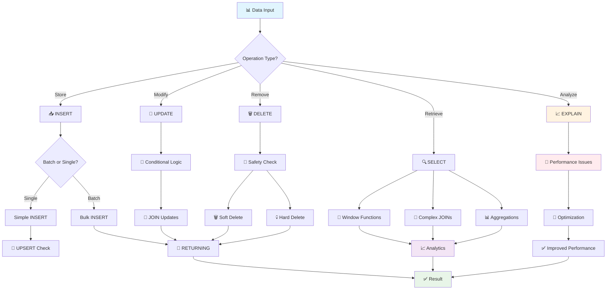
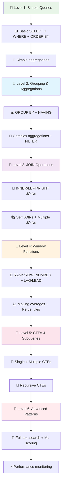
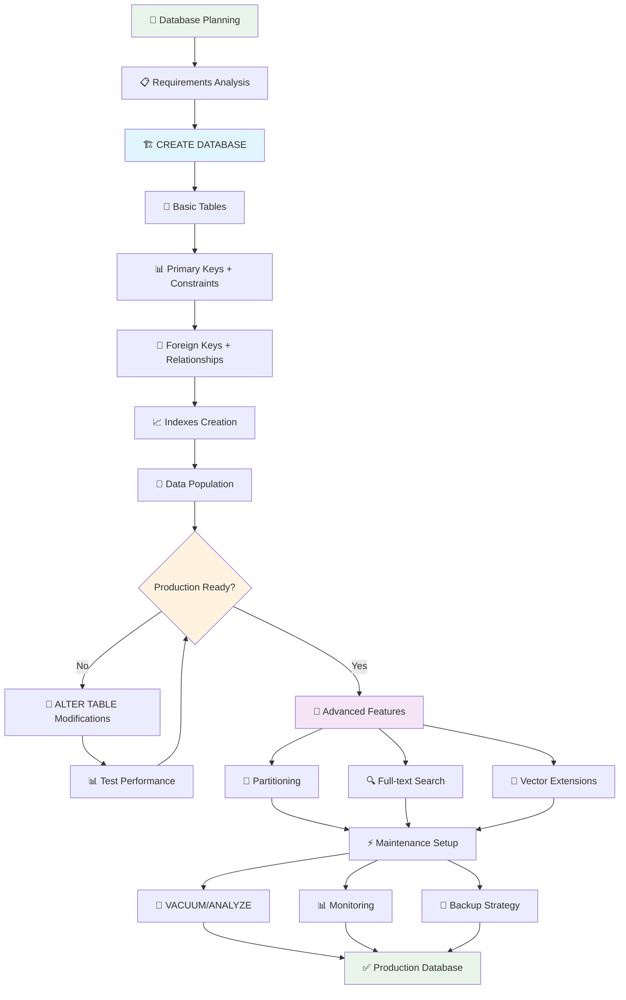

# 🚀 Powerful SQL Commands for Backend/AI Engineers


## 📖 Overview
Основа основ! Для ML Platform Engineer'а знание мощных SQL команд = способность эффективно работать с feature stores, метриками моделей и большими датасетами. Поехали! 🔥

## 🛠️ Core Data Operations

### 📥 INSERT: Storing Data Like a Pro

<details>
<summary>📥 <strong>INSERT операции - от базы до продакшена</strong></summary>

```sql
-- 🎯 Basic INSERT - простая вставка одной записи
INSERT INTO users (name, email, role) 
VALUES ('John Doe', 'john@example.com', 'analyst');

-- 🚀 Bulk INSERT (для AI datasets!) - массовая загрузка данных
INSERT INTO model_metrics (model_id, accuracy, precision, recall, created_at)
VALUES 
  ('gpt-4', 0.95, 0.92, 0.88, NOW()),      -- GPT-4 метрики
  ('claude-3', 0.93, 0.90, 0.85, NOW()),   -- Claude метрики
  ('llama-2', 0.87, 0.84, 0.82, NOW());    -- LLaMA метрики
-- 💡 Bulk INSERT в 10-100 раз быстрее отдельных INSERT'ов!

-- 💪 INSERT with RETURNING (получаем ID сразу!)
INSERT INTO experiments (name, config)
VALUES ('sentiment_analysis_v2', '{"model": "bert", "epochs": 10}')
RETURNING id, created_at;
-- 🎯 Возвращает: id=123, created_at=2025-01-15 14:30:00
-- 💡 Избегаем дополнительный SELECT для получения ID!

-- 🔄 UPSERT (INSERT ON CONFLICT) - идеально для feature updates!
INSERT INTO user_features (user_id, feature_vector, last_computed)
VALUES (12345, '[0.1, 0.2, 0.8]', NOW())
ON CONFLICT (user_id)           -- если user_id уже существует
DO UPDATE SET 
  feature_vector = EXCLUDED.feature_vector,    -- обновляем вектор
  last_computed = NOW(),                       -- и время
  update_count = COALESCE(update_count, 0) + 1; -- считаем обновления
-- 🎯 Либо создает новую запись, либо обновляет существующую!
```

**🚨 Red Flags для INSERT:**
- Много отдельных INSERT вместо bulk операций
- Отсутствие транзакций для связанных данных
- Игнорирование RETURNING когда нужен ID

</details>

### 🔄 UPDATE: Smart Data Modifications

<details>
<summary>🔄 <strong>UPDATE операции - умные обновления данных</strong></summary>

```sql
-- 🎯 Basic UPDATE - простое обновление
UPDATE user_sessions 
SET last_activity = NOW()           -- обновляем время активности
WHERE session_id = 'abc123'         -- для конкретной сессии
  AND status = 'active';            -- только если сессия активна

-- 🧠 Conditional UPDATE (для AI модели states)
UPDATE ml_models 
SET 
  status = CASE                     -- условное обновление статуса
    WHEN accuracy > 0.95 THEN 'production'     -- высокая точность -> продакшен
    WHEN accuracy > 0.85 THEN 'staging'        -- средняя -> тестирование  
    WHEN accuracy > 0.70 THEN 'development'    -- низкая -> разработка
    ELSE 'failed'                              -- совсем плохо -> провал
  END,
  last_evaluated = NOW(),           -- время последней оценки
  deployment_ready = (accuracy > 0.90)  -- готовность к деплою
WHERE model_type = 'text_classifier'     -- только для текстовых классификаторов
  AND created_at >= NOW() - INTERVAL '7 days';  -- недавно созданные

-- 🔗 UPDATE with JOIN (обновляем через связанные таблицы)
UPDATE products p
SET category_popularity = c.avg_rating    -- обновляем популярность категории
FROM (
  SELECT 
    category_id,
    AVG(rating) as avg_rating,          -- средний рейтинг по категории
    COUNT(*) as review_count            -- количество отзывов
  FROM product_reviews 
  WHERE created_at >= NOW() - INTERVAL '30 days'  -- за последний месяц
  GROUP BY category_id
  HAVING COUNT(*) >= 10                 -- минимум 10 отзывов
) c
WHERE p.category_id = c.category_id;    -- связываем продукты с категориями

-- 📊 UPDATE с подзапросом для ML features
UPDATE user_profiles 
SET 
  top_categories = (                    -- топ категории пользователя
    SELECT array_agg(category ORDER BY interaction_count DESC)
    FROM user_interactions ui
    WHERE ui.user_id = user_profiles.user_id
      AND ui.created_at >= NOW() - INTERVAL '90 days'  -- за 3 месяца
    GROUP BY user_id
    LIMIT 5                             -- топ-5 категорий
  ),
  activity_score = (                    -- скор активности
    SELECT COUNT(*) * 1.0 / EXTRACT(days FROM NOW() - MIN(created_at))
    FROM user_interactions ui2
    WHERE ui2.user_id = user_profiles.user_id
  )
WHERE last_updated < NOW() - INTERVAL '24 hours';  -- обновляем раз в день
```

**🚨 Red Flags для UPDATE:**
- UPDATE без WHERE (обновит ВСЕ записи!)
- Отсутствие индексов на WHERE условиях
- UPDATE в цикле вместо batch операции

</details>

### 🗑️ DELETE: Clean Data Management

<details>
<summary>🗑️ <strong>DELETE операции - умная очистка данных</strong></summary>

```sql
-- 🎯 Basic DELETE - простое удаление старых данных
DELETE FROM system_logs 
WHERE created_at < NOW() - INTERVAL '90 days'    -- старше 90 дней
  AND log_level NOT IN ('ERROR', 'CRITICAL');    -- кроме ошибок

-- 🧹 DELETE with subquery (удаляем связанные неактивные записи)
DELETE FROM model_artifacts 
WHERE model_id IN (
  SELECT m.id FROM ml_models m
  WHERE m.status = 'deprecated'                   -- устаревшие модели
    AND m.last_used < NOW() - INTERVAL '180 days' -- не использовались полгода
    AND NOT EXISTS (                              -- нет активных предсказаний
      SELECT 1 FROM predictions p 
      WHERE p.model_id = m.id 
        AND p.created_at >= NOW() - INTERVAL '30 days'
    )
);

-- 📊 DELETE with RETURNING (логируем что удалили)
DELETE FROM failed_predictions 
WHERE confidence_score < 0.1              -- очень низкая уверенность
  AND created_at < NOW() - INTERVAL '7 days'  -- старше недели
RETURNING 
  model_id, 
  COUNT(*) as deleted_count,              -- количество удаленных
  AVG(confidence_score) as avg_confidence;  -- средняя уверенность удаленных

-- 🔄 Soft DELETE (помечаем как удаленные, не удаляем физически)
UPDATE user_accounts 
SET 
  deleted_at = NOW(),                     -- помечаем время удаления
  email = 'deleted_' || id || '@deleted.com',  -- анонимизируем email
  status = 'deleted'
WHERE user_id = $1                        -- конкретный пользователь
  AND deleted_at IS NULL;                 -- еще не удален
```

**🚨 Red Flags для DELETE:**
- DELETE без WHERE (удалит ВСЮ таблицу!)
- Каскадное удаление без проверки связей
- Отсутствие бэкапа перед массовым удалением

</details>

## 🔍 Advanced SELECT Patterns

### 🎨 Window Functions (мощь для аналитики!)

<details>
<summary>🎨 <strong>Window Functions - аналитика на стероидах</strong></summary>

```sql
-- 📈 Ranking models by performance
SELECT 
  model_name,
  accuracy,
  -- 🏆 Ранжирование моделей по точности
  ROW_NUMBER() OVER (ORDER BY accuracy DESC) as rank,
  -- 📊 Сравнение с предыдущей моделью по рангу
  LAG(accuracy) OVER (ORDER BY accuracy DESC) as prev_accuracy,
  -- 📈 Насколько лучше предыдущей модели
  accuracy - LAG(accuracy) OVER (ORDER BY accuracy DESC) as improvement,
  -- 🎯 Процентиль производительности
  PERCENT_RANK() OVER (ORDER BY accuracy) * 100 as percentile
FROM model_performance
WHERE evaluated_at >= NOW() - INTERVAL '30 days'  -- последний месяц
ORDER BY accuracy DESC;

-- 📊 Running totals для метрик (кумулятивная статистика)
SELECT 
  date_trunc('day', created_at) as day,
  COUNT(*) as daily_predictions,           -- предсказаний за день
  -- 📈 Кумулятивная сумма предсказаний
  SUM(COUNT(*)) OVER (
    ORDER BY date_trunc('day', created_at)
  ) as cumulative_predictions,
  -- 📊 Скользящее среднее за 7 дней
  AVG(COUNT(*)) OVER (
    ORDER BY date_trunc('day', created_at)
    ROWS BETWEEN 6 PRECEDING AND CURRENT ROW
  ) as moving_avg_7_days,
  -- 🎯 Процентное изменение к предыдущему дню
  (COUNT(*) - LAG(COUNT(*)) OVER (ORDER BY date_trunc('day', created_at))) 
  / LAG(COUNT(*)) OVER (ORDER BY date_trunc('day', created_at))::float * 100 as daily_change_percent
FROM predictions
WHERE created_at >= NOW() - INTERVAL '60 days'
GROUP BY date_trunc('day', created_at)
ORDER BY day;

-- 🏷️ Partitioned ranking (ранжирование внутри групп)
SELECT 
  category,
  product_name,
  sales_amount,
  -- 🏆 Ранг внутри категории
  RANK() OVER (PARTITION BY category ORDER BY sales_amount DESC) as category_rank,
  -- 📊 Процент от общих продаж категории
  sales_amount / SUM(sales_amount) OVER (PARTITION BY category) * 100 as category_percent,
  -- 🎯 Топ-3 в категории?
  CASE 
    WHEN RANK() OVER (PARTITION BY category ORDER BY sales_amount DESC) <= 3 
    THEN 'Top 3' 
    ELSE 'Other' 
  END as performance_tier
FROM product_sales
WHERE sale_date >= NOW() - INTERVAL '30 days';
```

**💡 Объяснение Window Functions:**
- `OVER()` - определяет "окно" для расчета
- `PARTITION BY` - делит данные на группы
- `ORDER BY` - сортировка внутри окна
- `ROWS/RANGE` - границы окна для расчета

</details>

### 🔗 Advanced JOINs

<details>
<summary>🔗 <strong>Advanced JOIN операции - связываем данные эффективно</strong></summary>

```sql
-- 🎭 Comprehensive JOIN для полной картины данных
SELECT 
  u.user_id,
  u.email,
  u.registration_date,
  -- 📊 Данные профиля пользователя  
  p.age_group,
  p.location,
  -- 🤖 AI анализ поведения
  a.sentiment_score,
  a.engagement_level,
  a.predicted_churn_probability,
  -- 📈 Метрики активности
  s.total_sessions,
  s.avg_session_duration,
  s.last_activity,
  -- 💰 Данные подписки
  sub.plan_type,
  sub.monthly_revenue,
  sub.subscription_status
FROM users u
-- 👤 Профиль может отсутствовать у новых пользователей
LEFT JOIN user_profiles p ON u.user_id = p.user_id
-- 🤖 AI анализ только у активных пользователей  
LEFT JOIN ai_user_analysis a ON u.user_id = a.user_id 
  AND a.analysis_date >= NOW() - INTERVAL '7 days'
-- 📊 Сессии агрегируются на лету
LEFT JOIN (
  SELECT 
    user_id,
    COUNT(*) as total_sessions,
    AVG(duration_seconds) as avg_session_duration,
    MAX(created_at) as last_activity
  FROM user_sessions 
  WHERE created_at >= NOW() - INTERVAL '30 days'
  GROUP BY user_id
) s ON u.user_id = s.user_id
-- 💳 Подписка должна быть активной
INNER JOIN subscriptions sub ON u.user_id = sub.user_id 
  AND sub.status = 'active'
WHERE u.created_at >= NOW() - INTERVAL '90 days'  -- новые пользователи
  AND u.email_verified = true                     -- верифицированные
ORDER BY s.last_activity DESC NULLS LAST;

-- 🔄 Self JOIN для иерархических данных
SELECT 
  c.category_id,
  c.category_name,
  c.parent_id,
  -- 📊 Родительская категория
  parent.category_name as parent_category,
  -- 🏷️ Полный путь категории
  COALESCE(parent.category_name || ' > ', '') || c.category_name as full_path,
  -- 📈 Количество подкategорий
  (SELECT COUNT(*) FROM categories children 
   WHERE children.parent_id = c.category_id) as subcategories_count
FROM categories c
-- 🔗 Self JOIN для получения родительской категории
LEFT JOIN categories parent ON c.parent_id = parent.category_id
WHERE c.is_active = true
ORDER BY full_path;

-- 💡 LATERAL JOIN для сложной логики
SELECT 
  u.user_id,
  u.email,
  -- 🎯 Топ-3 недавние покупки для каждого пользователя
  recent_orders.product_names,
  recent_orders.total_amount,
  recent_orders.order_count
FROM users u
-- 📦 LATERAL позволяет ссылаться на u.user_id в подзапросе
LEFT JOIN LATERAL (
  SELECT 
    array_agg(p.product_name ORDER BY o.created_at DESC) as product_names,
    SUM(o.total_amount) as total_amount,
    COUNT(*) as order_count
  FROM orders o
  JOIN order_items oi ON o.order_id = oi.order_id
  JOIN products p ON oi.product_id = p.product_id
  WHERE o.user_id = u.user_id                    -- ссылка на внешнюю таблицу!
    AND o.created_at >= NOW() - INTERVAL '30 days'
  LIMIT 3
) recent_orders ON true
WHERE u.status = 'active';
```

**🚨 Red Flags для JOIN:**
- CROSS JOIN без WHERE (декартово произведение!)
- JOIN без индексов на ключах связи
- Множественные LEFT JOIN без необходимости

</details>

## 🎯 Specialized Commands for AI/Backend

### 📊 Aggregations for ML Metrics

<details>
<summary>📊 <strong>ML Aggregations - статистика для моделей</strong></summary>

```sql
-- 🧮 Model performance aggregation - полная статистика моделей
SELECT 
  model_name,
  model_version,
  -- 📊 Базовые метрики
  COUNT(*) as total_predictions,
  COUNT(*) FILTER (WHERE prediction_time < 100) as fast_predictions,  -- < 100ms
  -- 🎯 Статистика уверенности
  AVG(confidence_score) as avg_confidence,
  STDDEV(confidence_score) as confidence_std,
  MIN(confidence_score) as min_confidence,
  MAX(confidence_score) as max_confidence,
  -- 📈 Перцентили производительности
  PERCENTILE_CONT(0.50) WITHIN GROUP (ORDER BY confidence_score) as median_confidence,
  PERCENTILE_CONT(0.95) WITHIN GROUP (ORDER BY confidence_score) as p95_confidence,
  PERCENTILE_CONT(0.99) WITHIN GROUP (ORDER BY confidence_score) as p99_confidence,
  -- ✅ Точность модели (если есть ground truth)
  COUNT(*) FILTER (WHERE actual_result = predicted_result) / COUNT(*)::float as accuracy,
  -- ⚡ Производительность
  AVG(prediction_time_ms) as avg_prediction_time,
  PERCENTILE_CONT(0.95) WITHIN GROUP (ORDER BY prediction_time_ms) as p95_prediction_time,
  -- 📅 Временные паттерны
  COUNT(*) FILTER (WHERE created_at >= NOW() - INTERVAL '1 hour') as predictions_last_hour,
  COUNT(*) FILTER (WHERE created_at >= NOW() - INTERVAL '24 hours') as predictions_last_day
FROM model_predictions
WHERE created_at >= NOW() - INTERVAL '7 days'    -- последняя неделя
GROUP BY model_name, model_version
HAVING COUNT(*) >= 100                           -- минимум 100 предсказаний
ORDER BY accuracy DESC, avg_confidence DESC;

-- 📊 User behavior aggregation для recommendation систем  
SELECT 
  user_id,
  -- 🎭 Поведенческие паттерны
  COUNT(DISTINCT session_date) as active_days,
  COUNT(*) as total_interactions,
  AVG(session_duration_minutes) as avg_session_duration,
  -- 🏷️ Предпочтения по категориям
  array_agg(DISTINCT category ORDER BY interaction_count DESC) 
    FILTER (WHERE category_rank <= 3) as top_categories,
  -- 📈 Временные паттерны
  COUNT(*) FILTER (WHERE EXTRACT(hour FROM created_at) BETWEEN 9 AND 17) as business_hours_interactions,
  COUNT(*) FILTER (WHERE EXTRACT(dow FROM created_at) IN (0,6)) as weekend_interactions,
  -- 🎯 Engagement метрики
  AVG(rating) FILTER (WHERE rating IS NOT NULL) as avg_rating,
  COUNT(*) FILTER (WHERE interaction_type = 'like') as likes_count,
  COUNT(*) FILTER (WHERE interaction_type = 'share') as shares_count,
  -- 💡 ML features для модели
  CASE 
    WHEN COUNT(*) > 1000 THEN 'power_user'
    WHEN COUNT(*) > 100 THEN 'regular_user'  
    ELSE 'casual_user'
  END as user_segment
FROM (
  -- 🔄 Подготовка данных с ранжированием категорий
  SELECT 
    ui.*,
    DATE(ui.created_at) as session_date,
    COUNT(*) OVER (PARTITION BY ui.user_id, ui.category) as interaction_count,
    ROW_NUMBER() OVER (PARTITION BY ui.user_id ORDER BY COUNT(*) DESC) as category_rank
  FROM user_interactions ui
  WHERE ui.created_at >= NOW() - INTERVAL '90 days'
) user_stats
GROUP BY user_id
ORDER BY total_interactions DESC;
```

**💡 Полезные функции для ML:**
- `FILTER (WHERE ...)` - условная агрегация
- `PERCENTILE_CONT()` - точные перцентили
- `STDDEV()` - стандартное отклонение
- `array_agg()` - агрегация в массив

</details>

### 🔍 Complex Filtering for Feature Engineering

<details>
<summary>🔍 <strong>Feature Engineering - создание признаков для ML</strong></summary>

```sql
-- 🎨 Feature selection query - комплексная подготовка признаков
WITH user_behavior AS (
  -- 📊 Агрегация поведения пользователя по категориям
  SELECT 
    user_id,
    category,
    COUNT(*) as interaction_count,           -- количество взаимодействий
    AVG(session_duration_minutes) as avg_duration,  -- средняя длительность
    COUNT(*) FILTER (WHERE rating >= 4) as positive_interactions,  -- позитивные
    MAX(created_at) as last_interaction,     -- последнее взаимодействие
    -- 📈 Временные признаки
    COUNT(*) FILTER (WHERE EXTRACT(hour FROM created_at) < 12) as morning_interactions,
    COUNT(*) FILTER (WHERE EXTRACT(dow FROM created_at) IN (0,6)) as weekend_interactions
  FROM user_interactions
  WHERE created_at >= NOW() - INTERVAL '60 days'   -- последние 2 месяца
  GROUP BY user_id, category
),
user_preferences AS (
  -- 🏷️ Обработка предпочтений пользователя
  SELECT 
    user_id,
    -- 🎯 Топ категории по убыванию активности
    array_agg(category ORDER BY interaction_count DESC) as preferred_categories,
    -- 📊 Общая статистика
    SUM(interaction_count) as total_interactions,
    AVG(avg_duration) as overall_avg_duration,
    SUM(positive_interactions) as total_positive,
    MAX(last_interaction) as most_recent_activity,
    -- 💡 Признаки разнообразия
    COUNT(DISTINCT category) as categories_explored,
    -- 🕐 Временные паттерны
    SUM(morning_interactions) / SUM(interaction_count)::float as morning_ratio,
    SUM(weekend_interactions) / SUM(interaction_count)::float as weekend_ratio
  FROM user_behavior
  GROUP BY user_id
  HAVING SUM(interaction_count) >= 10        -- минимум 10 взаимодействий
),
user_segments AS (
  -- 🎭 Сегментация пользователей
  SELECT 
    *,
    -- 🏆 Уровень активности
    CASE 
      WHEN total_interactions >= 500 THEN 'power_user'
      WHEN total_interactions >= 100 THEN 'regular_user'
      WHEN total_interactions >= 20 THEN 'casual_user'
      ELSE 'new_user'
    END as activity_segment,
    -- 🎨 Тип поведения
    CASE 
      WHEN categories_explored >= 10 THEN 'explorer'
      WHEN total_positive / total_interactions::float > 0.8 THEN 'enthusiast'
      WHEN weekend_ratio > 0.6 THEN 'weekend_warrior'
      WHEN morning_ratio > 0.6 THEN 'early_bird'
      ELSE 'standard'
    END as behavior_type,
    -- 📈 Скор вовлеченности (0-100)
    LEAST(100, (
      (total_positive / total_interactions::float * 30) +           -- позитивность 30%
      (LEAST(categories_explored, 10) * 4) +                       -- разнообразие 40%  
      (LEAST(overall_avg_duration, 60) / 60 * 20) +               -- длительность 20%
      (CASE WHEN most_recent_activity >= NOW() - INTERVAL '7 days' THEN 10 ELSE 0 END)  -- недавность 10%
    )::int) as engagement_score
  FROM user_preferences
)
-- 🎯 Финальный набор признаков для ML модели
SELECT 
  us.user_id,
  -- 📊 Базовые признаки
  us.preferred_categories[1:3] as top_3_categories,    -- топ-3 категории
  us.total_interactions,
  us.categories_explored,
  us.overall_avg_duration,
  -- 🏷️ Категориальные признаки
  us.activity_segment,
  us.behavior_type,
  -- 📈 Численные признаки
  us.engagement_score,
  us.morning_ratio,
  us.weekend_ratio,
  (us.total_positive::float / us.total_interactions) as positivity_ratio,
  -- ⏰ Временные признаки
  EXTRACT(days FROM NOW() - us.most_recent_activity) as days_since_last_activity,
  -- 🎯 Бинарные признаки (для tree-based моделей)
  (us.engagement_score >= 70) as high_engagement,
  (us.categories_explored >= 5) as diverse_interests,
  (us.total_interactions >= 100) as active_user,
  -- 📊 Интерактивные признаки
  us.total_interactions * us.engagement_score as weighted_activity_score
FROM user_segments us
WHERE us.most_recent_activity >= NOW() - INTERVAL '30 days'  -- активные за месяц
ORDER BY us.engagement_score DESC, us.total_interactions DESC;
```

**🎯 Feature Engineering Tips:**
- Создавай ratio-признаки (пропорции) для нормализации
- Используй временные окна разной длины
- Комбинируй категориальные и численные признаки
- Создавай интерактивные признаки (произведения)

</details>

## 🔧 Performance & Monitoring Commands

### 📈 Query Optimization & Diagnostics

<details>
<summary>📈 <strong>EXPLAIN ANALYZE и мониторинг производительности</strong></summary>

```sql
-- 🔍 EXPLAIN ANALYZE для диагностики векторных запросов
EXPLAIN (ANALYZE, BUFFERS, FORMAT JSON) 
SELECT 
  product_id,
  product_name,
  embedding <-> '[0.1, 0.2, 0.3, ...]'::vector as similarity_score
FROM products 
WHERE embedding <-> '[0.1, 0.2, 0.3, ...]'::vector < 0.5    -- similarity threshold
ORDER BY embedding <-> '[0.1, 0.2, 0.3, ...]'::vector       -- order by distance
LIMIT 20;
-- 🎯 Параметры:
-- ANALYZE = реально выполняет и замеряет время ⏱️
-- BUFFERS = показывает использование памяти 💾
-- FORMAT JSON = структурированный вывод 📊

-- 📊 Index usage analysis - поиск неэффективных индексов
SELECT 
  schemaname,
  tablename,
  indexname,
  idx_scan,                                    -- количество использований индекса
  idx_tup_read,                               -- строк прочитано через индекс
  idx_tup_fetch,                              -- строк получено из таблицы
  pg_size_pretty(pg_relation_size(indexname::regclass)) as index_size,
  -- 📈 Эффективность индекса (соотношение fetch/read)
  CASE 
    WHEN idx_tup_read > 0 
    THEN round((idx_tup_fetch::numeric / idx_tup_read * 100), 2)
    ELSE 0 
  END as efficiency_percent
FROM pg_stat_user_indexes
WHERE idx_scan < 1000                         -- 🚨 подозрительно мало использований
ORDER BY pg_relation_size(indexname::regclass) DESC;

-- ⚡ Медленные запросы (требует pg_stat_statements)
SELECT 
  LEFT(query, 100) as query_preview,          -- первые 100 символов запроса
  calls,                                      -- количество выполнений
  round(mean_time::numeric, 2) as avg_time_ms, -- среднее время в мс
  round(total_time::numeric, 2) as total_time_ms, -- общее время
  round((100 * total_time / sum(total_time) OVER())::numeric, 2) as percent_total_time,
  rows as avg_rows_returned                   -- среднее количество строк
FROM pg_stat_statements 
WHERE mean_time > 50                         -- 🚨 медленнее 50ms
  AND calls > 10                             -- выполнялся минимум 10 раз
ORDER BY total_time DESC                     -- самые затратные сверху
LIMIT 20;

-- 🔒 Блокировки и конкурентный доступ
SELECT 
  bl.pid,
  a.usename,
  a.query_start,
  a.state,
  a.query as blocked_query,
  -- 🚨 Информация о блокирующем процессе
  kl.pid as blocking_pid,
  ka.usename as blocking_user,  
  ka.query as blocking_query,
  -- ⏰ Как долго заблокирован
  NOW() - a.query_start as blocked_duration
FROM pg_catalog.pg_locks bl
JOIN pg_catalog.pg_stat_activity a ON bl.pid = a.pid
JOIN pg_catalog.pg_locks kl ON bl.transactionid = kl.transactionid
JOIN pg_catalog.pg_stat_activity ka ON kl.pid = ka.pid
WHERE NOT bl.granted                         -- только заблокированные
  AND bl.pid != ka.pid                       -- исключаем self-блокировки
ORDER BY a.query_start;
```

**🚨 Red Flags в EXPLAIN результатах:**
- `Seq Scan` на больших таблицах без WHERE фильтров
- `Execution Time` > 1000ms для простых запросов  
- `Buffers: read` >> `shared hit` (данные не в кэше)
- `Nested Loop` с большим количеством строк
- Отсутствие использования индексов

</details>

## 🚀 Pro Tips для Production

### 💡 Best Practices & Performance Hacks

<details>
<summary>💡 <strong>Production-Ready SQL паттерны</strong></summary>

```sql
```sql
-- 🎯 Parameterized queries (защита от SQL injection)
SELECT * FROM users 
WHERE email = $1                    -- ✅ ПРАВИЛЬНО - параметризованный запрос
  AND status = $2;
-- ❌ НЕПРАВИЛЬНО: WHERE email = '" + user_input + "'"

-- 📊 Эффективная пагинация (избегаем OFFSET)
SELECT * FROM products
WHERE id > $1                       -- последний ID с предыдущей страницы
ORDER BY id
LIMIT 20;
-- 🚀 В разы быстрее чем OFFSET 1000000 LIMIT 20

-- 🔄 Batch operations вместо циклов
INSERT INTO user_stats (user_id, metric_value, calculated_at)
SELECT 
  user_id,
  COUNT(*) as interaction_count,
  NOW()
FROM user_interactions
WHERE created_at >= CURRENT_DATE
GROUP BY user_id;
-- 💡 Одним запросом вместо тысяч отдельных INSERT

-- ⚡ Быстрый подсчет строк (оценка)
SELECT reltuples::bigint as estimated_rows
FROM pg_class
WHERE relname = 'large_table';
-- 🚀 Мгновенно vs медленный COUNT(*)

-- 🛡️ Безопасные транзакции для связанных операций
BEGIN;
  INSERT INTO orders (user_id, total_amount) 
  VALUES ($1, $2) 
  RETURNING id INTO @order_id;
  
  INSERT INTO order_items (order_id, product_id, quantity)
  SELECT @order_id, product_id, quantity 
  FROM cart_items 
  WHERE user_id = $1;
  
  DELETE FROM cart_items WHERE user_id = $1;
COMMIT;
-- 🎯 Либо все операции успешны, либо откат всех изменений

-- 📈 Conditional aggregation (избегаем множественных запросов)
SELECT 
  DATE(created_at) as date,
  COUNT(*) as total_events,
  COUNT(*) FILTER (WHERE event_type = 'click') as clicks,
  COUNT(*) FILTER (WHERE event_type = 'view') as views,
  COUNT(*) FILTER (WHERE event_type = 'purchase') as purchases,
  -- 📊 Конверсии на лету
  COUNT(*) FILTER (WHERE event_type = 'purchase') * 100.0 / 
  NULLIF(COUNT(*) FILTER (WHERE event_type = 'view'), 0) as conversion_rate
FROM events
WHERE created_at >= NOW() - INTERVAL '30 days'
GROUP BY DATE(created_at)
ORDER BY date;

-- 🔍 Существование записи (эффективно)
SELECT EXISTS(
  SELECT 1 FROM user_subscriptions 
  WHERE user_id = $1 
    AND status = 'active'
    AND expires_at > NOW()
) as has_active_subscription;
-- ⚡ Останавливается на первом найденном

-- 💾 Memory-efficient CTEs с материализацией
WITH MATERIALIZED popular_categories AS (
  SELECT category_id, COUNT(*) as product_count
  FROM products
  WHERE created_at >= NOW() - INTERVAL '30 days'
  GROUP BY category_id
  HAVING COUNT(*) >= 100
)
SELECT 
  c.category_name,
  pc.product_count,
  c.description
FROM popular_categories pc
JOIN categories c ON pc.category_id = c.id
ORDER BY pc.product_count DESC;
-- 🎯 MATERIALIZED заставляет PostgreSQL сохранить результат CTE в памяти
```

**⚡ Performance Optimization Checklist:**

1. **Индексы на WHERE/JOIN колонках** 📊
2. **LIMIT для больших результатов** 🔢  
3. **Параметризованные запросы** 🛡️
4. **Batch операции вместо циклов** 🔄
5. **EXISTS вместо COUNT > 0** ✅
6. **Cursor-based pagination** 📄

</details>

## 🎨 Mermaid: SQL Operations Flow


```mermaid
flowchart TD
    A[📊 Data Input] --> B{Operation Type?}
    
    B -->|Store| C[📥 INSERT]
    B -->|Modify| D[🔄 UPDATE]  
    B -->|Remove| E[🗑️ DELETE]
    B -->|Retrieve| F[🔍 SELECT]
    B -->|Analyze| G[📈 EXPLAIN]
    
    C --> H{Batch or Single?}
    H -->|Single| I[Simple INSERT]
    H -->|Batch| J[Bulk INSERT]
    J --> K[💪 RETURNING]
    I --> L[🔄 UPSERT Check]
    
    D --> M[🧠 Conditional Logic]
    M --> N[🔗 JOIN Updates] 
    N --> K
    
    E --> O[🚨 Safety Check]
    O --> P[🗑️ Soft Delete]
    O --> Q[💀 Hard Delete]
    P --> K
    Q --> K
    
    F --> R[🎨 Window Functions]
    F --> S[🔗 Complex JOINs]
    F --> T[📊 Aggregations]
    
    R --> U[📈 Analytics]
    S --> U
    T --> U
    
    G --> V[🚨 Performance Issues]
    V --> W[🔧 Optimization]
    W --> X[✅ Improved Performance]
    
    K --> Y[✅ Result]
    U --> Y
    X --> Y
    
    style A fill:#e1f5fe
    style G fill:#fff3e0
    style U fill:#f3e5f5
    style V fill:#ffebee
    style Y fill:#e8f5e8
```

## 🎯 Summary

Бро, это **арсенал SQL команд для production систем**! 🔥 

**Ключевые принципы:**
- **Безопасность**: параметризованные запросы, транзакции
- **Производительность**: индексы, batch операции, правильная пагинация  
- **Мониторинг**: EXPLAIN ANALYZE, статистика индексов
- **Масштабируемость**: window functions, эффективные JOIN'ы
- **Maintenance**: умное удаление данных, feature engineering

С такой базой ты готов строить **высокопроизводительные ML платформы** и **enterprise backend системы**! 🚀✨

# 🚀 Step-by-Step SQL Queries: От простых к сложным


## 📖 Overview
Бро, это пошаговый гайд по построению SQL запросов - от базовых SELECT до enterprise-уровня аналитики! 🎯 Для Backend/AI Engineer'а умение декомпозировать сложную задачу на простые SQL шаги = ключ к эффективной работе с данными. Поехали строить запросы как профи! 🔥

## 🎯 Level 1: Simple Queries - Основа основ

<details>
<summary>🔍 <strong>Базовые SELECT операции - строим фундамент</strong></summary>

```sql
-- 🎯 Шаг 1: Простейший SELECT - получаем все данные
SELECT * FROM users;
-- 💡 Что делает: Возвращает ВСЕ колонки и строки из таблицы users
-- 🚨 Red Flag: Никогда не используй SELECT * в production! Трафик и память!

-- 🔍 Шаг 2: Выбираем конкретные колонки
SELECT user_id, email, created_at FROM users;
-- ✅ Правильно: Только нужные данные = быстрее и меньше трафика

-- 🎯 Шаг 3: Добавляем простое условие WHERE
SELECT user_id, email, created_at 
FROM users
WHERE status = 'active';
-- 💡 Фильтруем только активных пользователей

-- 🔢 Шаг 4: Работа с числовыми условиями
SELECT user_id, email, age
FROM users  
WHERE age >= 18              -- совершеннолетние
  AND age < 65               -- но не пенсионеры
  AND status = 'active';     -- и активные
-- 🎯 Логические операторы AND/OR для комбинирования условий

-- 📅 Шаг 5: Временные фильтры
SELECT user_id, email, created_at
FROM users
WHERE created_at >= '2024-01-01'                    -- с начала года
  AND created_at < NOW() - INTERVAL '7 days';       -- но не последнюю неделю
-- 💡 INTERVAL для относительных дат - очень удобно!

-- 🔤 Шаг 6: Текстовый поиск
SELECT user_id, email, first_name, last_name
FROM users
WHERE email ILIKE '%gmail.com'              -- регистронезависимый поиск
  OR first_name ILIKE 'john%'                -- имя начинается с John
  AND last_name IS NOT NULL;                 -- фамилия заполнена
-- 🎯 ILIKE вместо LIKE для игнорирования регистра

-- 📊 Шаг 7: Сортировка и лимит
SELECT user_id, email, created_at, last_login
FROM users
WHERE status = 'active'
ORDER BY last_login DESC                     -- сначала недавно активные
LIMIT 100;                                   -- только топ-100
-- ⚡ LIMIT экономит ресурсы и время выполнения
```

**🎯 Ключевые принципы простых запросов:**
- Всегда указывай конкретные колонки вместо `SELECT *`
- Используй индексы в WHERE условиях  
- Добавляй LIMIT для больших таблиц
- Проверяй NULL значения через `IS NULL/IS NOT NULL`

**🚨 Red Flags на базовом уровне:**
- `SELECT *` в production коде
- WHERE условия без индексов
- Забытый LIMIT на больших таблицах
- Сравнение NULL через `= NULL` (неработает!)

</details>

## 🔄 Level 2: Aggregations & Grouping - Суммируем и группируем

<details>
<summary>📊 <strong>GROUP BY и агрегации - превращаем данные в инсайты</strong></summary>

```sql
-- 🎯 Шаг 1: Простой подсчет записей
SELECT COUNT(*) as total_users FROM users;
-- 💡 Количество всех пользователей в системе

-- 📊 Шаг 2: Группировка по одному полю
SELECT 
  status,                           -- группируем по статусу
  COUNT(*) as user_count           -- считаем пользователей в каждой группе
FROM users
GROUP BY status                     -- обязательно GROUP BY для агрегации!
ORDER BY user_count DESC;          -- сначала самые большие группы
-- 🎯 Результат: active: 1500, inactive: 300, banned: 50

-- 🔍 Шаг 3: Множественные агрегации
SELECT 
  status,
  COUNT(*) as user_count,                    -- количество
  AVG(age) as avg_age,                      -- средний возраст  
  MIN(created_at) as first_registration,     -- первая регистрация
  MAX(last_login) as most_recent_login      -- последний вход
FROM users
WHERE age IS NOT NULL                       -- исключаем NULL возрасты
GROUP BY status
ORDER BY user_count DESC;

-- 📈 Шаг 4: Фильтрация групп через HAVING
SELECT 
  DATE(created_at) as registration_date,
  COUNT(*) as daily_registrations,
  AVG(age) as avg_age_of_day
FROM users
WHERE created_at >= NOW() - INTERVAL '30 days'  -- последний месяц
GROUP BY DATE(created_at)                        -- группируем по дням
HAVING COUNT(*) >= 10                           -- только дни с 10+ регистрациями  
ORDER BY registration_date DESC;
-- 💡 HAVING фильтрует группы ПОСЛЕ агрегации, WHERE - ДО

-- 🎭 Шаг 5: Сложная группировка по нескольким полям
SELECT 
  DATE_TRUNC('week', created_at) as week,    -- группируем по неделям
  country,                                   -- и по странам
  COUNT(*) as registrations,
  COUNT(DISTINCT email_domain) as unique_domains,  -- уникальные домены
  AVG(age) FILTER (WHERE age BETWEEN 18 AND 65) as working_age_avg  -- условная агрегация
FROM users u
JOIN user_profiles up ON u.user_id = up.user_id
WHERE created_at >= NOW() - INTERVAL '90 days'
GROUP BY DATE_TRUNC('week', created_at), country
HAVING COUNT(*) >= 5                         -- минимум 5 регистраций в неделю
ORDER BY week DESC, registrations DESC;

-- 📊 Шаг 6: Продвинутые агрегации для ML метрик
SELECT 
  model_name,
  DATE(created_at) as prediction_date,
  COUNT(*) as total_predictions,
  -- 📈 Статистические метрики
  AVG(confidence_score) as avg_confidence,
  STDDEV(confidence_score) as confidence_std,
  -- 🎯 Перцентили производительности  
  PERCENTILE_CONT(0.5) WITHIN GROUP (ORDER BY response_time_ms) as median_response_time,
  PERCENTILE_CONT(0.95) WITHIN GROUP (ORDER BY response_time_ms) as p95_response_time,
  -- ✅ Точность модели
  COUNT(*) FILTER (WHERE prediction_correct = true) * 100.0 / COUNT(*) as accuracy_percent,
  -- 🚨 Процент низкой уверенности
  COUNT(*) FILTER (WHERE confidence_score < 0.7) * 100.0 / COUNT(*) as low_confidence_percent
FROM model_predictions
WHERE created_at >= CURRENT_DATE - INTERVAL '7 days'
GROUP BY model_name, DATE(created_at)
HAVING COUNT(*) >= 100                       -- минимум 100 предсказаний для статистики
ORDER BY prediction_date DESC, accuracy_percent DESC;
```

**🎯 Пошаговый алгоритм построения GROUP BY запросов:**
1. **Определи что группируешь** (GROUP BY колонки)  
2. **Выбери агрегации** (COUNT, AVG, SUM, etc.)
3. **Добавь WHERE** для фильтрации исходных данных
4. **Используй HAVING** для фильтрации результатов групп  
5. **Сортируй результат** (ORDER BY)

**🚨 Red Flags в агрегациях:**
- Колонки в SELECT, которых нет в GROUP BY
- WHERE вместо HAVING для фильтрации групп
- Агрегация без учета NULL значений
- Отсутствие минимального порога в HAVING

</details>

## 🔗 Level 3: Joins - Связываем таблицы

<details>
<summary>🔗 <strong>JOIN операции - от простых до сложных связей</strong></summary>

```sql
-- 🎯 Шаг 1: Простой INNER JOIN - только совпадающие записи
SELECT 
  u.user_id,
  u.email,
  p.first_name,
  p.last_name
FROM users u
INNER JOIN user_profiles p ON u.user_id = p.user_id
WHERE u.status = 'active';
-- 💡 Получаем только пользователей, у которых есть профиль

-- 🔍 Шаг 2: LEFT JOIN - сохраняем все записи слева  
SELECT 
  u.user_id,
  u.email,
  u.created_at,
  p.first_name,           -- может быть NULL если профиля нет
  p.last_name,            -- может быть NULL
  COALESCE(p.first_name, 'Unknown') as display_name  -- заменяем NULL
FROM users u  
LEFT JOIN user_profiles p ON u.user_id = p.user_id
WHERE u.created_at >= NOW() - INTERVAL '30 days'
ORDER BY u.created_at DESC;
-- 🎯 Получаем ВСЕХ пользователей, профиль опционален

-- 🔄 Шаг 3: Множественные JOIN'ы - строим цепочку связей
SELECT 
  u.email,
  p.first_name,
  p.last_name,
  s.subscription_type,
  s.expires_at,
  -- 📊 Считаем активность пользователя
  COUNT(a.activity_id) as recent_activities
FROM users u
LEFT JOIN user_profiles p ON u.user_id = p.user_id
LEFT JOIN subscriptions s ON u.user_id = s.user_id 
  AND s.status = 'active'                    -- только активные подписки
LEFT JOIN user_activities a ON u.user_id = a.user_id
  AND a.created_at >= NOW() - INTERVAL '7 days'  -- только недавние активности
WHERE u.status = 'active'
GROUP BY u.user_id, u.email, p.first_name, p.last_name, s.subscription_type, s.expires_at
ORDER BY recent_activities DESC;
-- 💡 Пошагово джоиним: users -> profiles -> subscriptions -> activities

-- 🎭 Шаг 4: Self JOIN - связываем таблицу саму с собой
SELECT 
  e.employee_id,
  e.name as employee_name,
  e.position,
  m.name as manager_name,        -- имя руководителя
  m.position as manager_position
FROM employees e
LEFT JOIN employees m ON e.manager_id = m.employee_id  -- self join!
WHERE e.department = 'Engineering'
ORDER BY m.name, e.name;
-- 🎯 Получаем сотрудников с информацией об их руководителях

-- 📊 Шаг 5: JOIN с агрегированными данными
SELECT 
  u.user_id,
  u.email,
  u.created_at,
  -- 🛒 Статистика заказов из подзапроса
  order_stats.total_orders,
  order_stats.total_spent,
  order_stats.avg_order_value,
  order_stats.last_order_date,
  -- 🏷️ Категоризация клиентов
  CASE 
    WHEN order_stats.total_spent > 1000 THEN 'VIP'
    WHEN order_stats.total_spent > 100 THEN 'Regular'
    ELSE 'New'
  END as customer_segment
FROM users u
LEFT JOIN (
  -- 📈 Агрегируем статистику заказов для каждого пользователя
  SELECT 
    user_id,
    COUNT(*) as total_orders,
    SUM(total_amount) as total_spent,
    AVG(total_amount) as avg_order_value,
    MAX(created_at) as last_order_date
  FROM orders
  WHERE status = 'completed'
    AND created_at >= NOW() - INTERVAL '1 year'  -- за последний год
  GROUP BY user_id
) order_stats ON u.user_id = order_stats.user_id
WHERE u.status = 'active'
ORDER BY order_stats.total_spent DESC NULLS LAST;  -- VIP клиенты сверху

-- 🤖 Шаг 6: Сложный JOIN для ML pipeline
SELECT 
  u.user_id,
  u.email,
  -- 👤 Профильные данные
  p.age_group,
  p.country,
  -- 🎭 Поведенческие метрики
  behavior.session_count,
  behavior.avg_session_duration,
  behavior.total_interactions,
  -- 🤖 AI предсказания
  predictions.churn_probability,
  predictions.recommended_actions,
  predictions.confidence_score,
  -- 📊 Engagement скор  
  engagement.email_open_rate,
  engagement.click_through_rate,
  engagement.last_engagement_date
FROM users u
LEFT JOIN user_profiles p ON u.user_id = p.user_id
-- 📈 Агрегированное поведение за последние 30 дней
LEFT JOIN (
  SELECT 
    user_id,
    COUNT(DISTINCT session_id) as session_count,
    AVG(duration_minutes) as avg_session_duration,
    SUM(interaction_count) as total_interactions
  FROM user_sessions
  WHERE created_at >= NOW() - INTERVAL '30 days'
  GROUP BY user_id
) behavior ON u.user_id = behavior.user_id
-- 🧠 Последние AI предсказания  
LEFT JOIN (
  SELECT DISTINCT ON (user_id)  -- только последний прогноз
    user_id,
    churn_probability,
    recommended_actions,
    confidence_score
  FROM ml_user_predictions
  WHERE model_version = 'v2.1'
    AND created_at >= NOW() - INTERVAL '7 days'
  ORDER BY user_id, created_at DESC
) predictions ON u.user_id = predictions.user_id
-- 📧 Email engagement метрики
LEFT JOIN (
  SELECT 
    user_id,
    COUNT(*) FILTER (WHERE opened = true) * 100.0 / COUNT(*) as email_open_rate,
    COUNT(*) FILTER (WHERE clicked = true) * 100.0 / COUNT(*) as click_through_rate,
    MAX(created_at) as last_engagement_date
  FROM email_campaigns
  WHERE sent_at >= NOW() - INTERVAL '90 days'
  GROUP BY user_id
) engagement ON u.user_id = engagement.user_id
WHERE u.status = 'active'
  AND u.created_at >= NOW() - INTERVAL '180 days'  -- пользователи за полгода
ORDER BY predictions.churn_probability DESC NULLS LAST;
```

**🎯 Пошаговый алгоритм построения JOIN'ов:**
1. **Начни с главной таблицы** (FROM)
2. **Определи тип связи** (INNER/LEFT/RIGHT/FULL)  
3. **Укажи условие связи** (ON колонка1 = колонка2)
4. **Добавляй JOIN'ы поэтапно**, проверяя каждый
5. **Группируй при необходимости** (если есть агрегации)
6. **Оптимизируй порядок JOIN'ов** (меньшие таблицы первыми)

**🚨 Red Flags в JOIN'ах:**
- JOIN без индексов на связанных колонках
- CROSS JOIN вместо INNER JOIN (декартово произведение!)
- Множественные LEFT JOIN без необходимости
- Забытый GROUP BY при агрегации в JOIN'ах

</details>

## 🎨 Level 4: Window Functions - Аналитические функции

<details>
<summary>🎨 <strong>Window Functions - аналитика без GROUP BY</strong></summary>

```sql
-- 🎯 Шаг 1: Базовая оконная функция - ранжирование
SELECT 
  product_id,
  product_name,
  category,
  price,
  -- 🏆 Ранг по цене внутри категории
  RANK() OVER (PARTITION BY category ORDER BY price DESC) as price_rank,
  -- 📊 Порядковый номер (без пропусков)
  ROW_NUMBER() OVER (PARTITION BY category ORDER BY price DESC) as price_position
FROM products
WHERE is_active = true
ORDER BY category, price_rank;
-- 💡 PARTITION BY = группировка, ORDER BY = сортировка внутри группы

-- 📈 Шаг 2: Сравнение с предыдущими/следующими записями
SELECT 
  user_id,
  login_date,
  session_duration_minutes,
  -- 📊 Сравнение с предыдущей сессией
  LAG(session_duration_minutes) OVER (
    PARTITION BY user_id ORDER BY login_date
  ) as prev_session_duration,
  -- 🔍 Изменение длительности сессии  
  session_duration_minutes - LAG(session_duration_minutes) OVER (
    PARTITION BY user_id ORDER BY login_date  
  ) as duration_change,
  -- 📈 Следующая сессия
  LEAD(login_date) OVER (
    PARTITION BY user_id ORDER BY login_date
  ) as next_login_date,
  -- ⏰ Интервал между сессиями
  LEAD(login_date) OVER (
    PARTITION BY user_id ORDER BY login_date
  ) - login_date as time_to_next_session
FROM user_sessions
WHERE login_date >= NOW() - INTERVAL '30 days'
ORDER BY user_id, login_date;
-- 🎯 Анализируем изменения поведения пользователей во времени

-- 📊 Шаг 3: Накопительные (кумулятивные) функции  
SELECT 
  DATE(order_date) as day,
  daily_revenue,
  daily_orders,
  -- 📈 Кумулятивная выручка
  SUM(daily_revenue) OVER (
    ORDER BY DATE(order_date)
    ROWS UNBOUNDED PRECEDING  -- от начала до текущей строки
  ) as cumulative_revenue,
  -- 📊 Скользящая средняя за 7 дней
  AVG(daily_revenue) OVER (
    ORDER BY DATE(order_date)
    ROWS BETWEEN 6 PRECEDING AND CURRENT ROW  -- текущая + 6 предыдущих
  ) as moving_avg_7_days,
  -- 🎯 Процентное изменение к предыдущему дню
  (daily_revenue - LAG(daily_revenue) OVER (ORDER BY DATE(order_date))) 
  / LAG(daily_revenue) OVER (ORDER BY DATE(order_date)) * 100 as daily_change_percent
FROM (
  -- 📈 Агрегируем данные по дням
  SELECT 
    DATE(created_at) as order_date,
    SUM(total_amount) as daily_revenue,
    COUNT(*) as daily_orders
  FROM orders
  WHERE status = 'completed'
    AND created_at >= NOW() - INTERVAL '90 days'
  GROUP BY DATE(created_at)
) daily_stats
ORDER BY day;

-- 🎭 Шаг 4: Процентили и статистические функции
SELECT 
  model_name,
  prediction_date,
  response_time_ms,
  confidence_score,
  -- 📊 Процентильный ранг производительности
  PERCENT_RANK() OVER (
    PARTITION BY model_name 
    ORDER BY response_time_ms
  ) * 100 as response_time_percentile,
  -- 🎯 Квартили уверенности
  NTILE(4) OVER (
    PARTITION BY model_name 
    ORDER BY confidence_score
  ) as confidence_quartile,
  -- 📈 Z-score для выявления аномалий
  (confidence_score - AVG(confidence_score) OVER (PARTITION BY model_name)) 
  / STDDEV(confidence_score) OVER (PARTITION BY model_name) as confidence_z_score,
  -- 🚨 Флаг аномальных предсказаний
  CASE 
    WHEN ABS((confidence_score - AVG(confidence_score) OVER (PARTITION BY model_name)) 
        / STDDEV(confidence_score) OVER (PARTITION BY model_name)) > 2 
    THEN 'Anomaly'
    ELSE 'Normal'
  END as anomaly_flag
FROM model_predictions
WHERE prediction_date >= CURRENT_DATE - INTERVAL '7 days'
ORDER BY model_name, prediction_date, response_time_ms;

-- 🎨 Шаг 5: Комплексный анализ с множественными окнами
SELECT 
  u.user_id,
  u.email,
  s.session_date,
  s.duration_minutes,
  s.pages_viewed,
  -- 🏆 Ранжирование сессий пользователя  
  ROW_NUMBER() OVER (
    PARTITION BY u.user_id 
    ORDER BY s.duration_minutes DESC
  ) as session_rank_by_duration,
  -- 📊 Процентиль длительности среди всех пользователей
  PERCENT_RANK() OVER (
    ORDER BY s.duration_minutes
  ) * 100 as global_duration_percentile,
  -- 📈 Скользящее среднее активности пользователя
  AVG(s.pages_viewed) OVER (
    PARTITION BY u.user_id 
    ORDER BY s.session_date
    ROWS BETWEEN 4 PRECEDING AND CURRENT ROW  -- последние 5 сессий
  ) as user_avg_activity_trend,
  -- 🎯 Сравнение с общим средним
  s.duration_minutes - AVG(s.duration_minutes) OVER () as duration_vs_global_avg,
  -- 📊 Первая и последняя сессия пользователя
  FIRST_VALUE(s.session_date) OVER (
    PARTITION BY u.user_id 
    ORDER BY s.session_date 
    ROWS UNBOUNDED PRECEDING
  ) as first_session_date,
  LAST_VALUE(s.session_date) OVER (
    PARTITION BY u.user_id 
    ORDER BY s.session_date 
    ROWS BETWEEN UNBOUNDED PRECEDING AND UNBOUNDED FOLLOWING
  ) as last_session_date,
  -- ⏰ Дни с первой сессии
  s.session_date - FIRST_VALUE(s.session_date) OVER (
    PARTITION BY u.user_id 
    ORDER BY s.session_date 
    ROWS UNBOUNDED PRECEDING
  ) as days_since_first_session
FROM users u
JOIN user_sessions s ON u.user_id = s.user_id
WHERE s.session_date >= NOW() - INTERVAL '60 days'
  AND u.status = 'active'
ORDER BY u.user_id, s.session_date;
```

**🎯 Ключевые концепции Window Functions:**
- **PARTITION BY** - как GROUP BY, но без схлопывания строк
- **ORDER BY** - сортировка внутри окна  
- **ROWS/RANGE** - границы окна для расчета
- **Аналитические функции** работают ПОСЛЕ WHERE/GROUP BY/HAVING

**🚨 Red Flags в Window Functions:**
- Отсутствие индексов на PARTITION BY/ORDER BY колонках
- Слишком большие окна (UNBOUNDED) на больших таблицах
- Множественные одинаковые OVER() клаузы (можно вынести в WINDOW)

</details>

## 🧠 Level 5: CTEs & Subqueries - Разбиваем сложность

<details>
<summary>🧠 <strong>Common Table Expressions - структурируем сложную логику</strong></summary>

```sql
-- 🎯 Шаг 1: Базовый CTE - заменяем подзапрос на читаемый блок
WITH active_users AS (
  -- 👥 Первый шаг: определяем активных пользователей
  SELECT user_id, email, created_at
  FROM users  
  WHERE status = 'active'
    AND last_login >= NOW() - INTERVAL '30 days'
)
SELECT 
  au.user_id,
  au.email,
  COUNT(o.order_id) as recent_orders
FROM active_users au  -- используем CTE как обычную таблицу
LEFT JOIN orders o ON au.user_id = o.user_id
  AND o.created_at >= NOW() - INTERVAL '30 days'
GROUP BY au.user_id, au.email
ORDER BY recent_orders DESC;
-- 💡 CTE делает запрос читаемым и позволяет переиспользовать логику

-- 📊 Шаг 2: Множественные CTE - пошаговая декомпозиция задачи
WITH user_stats AS (
  -- 📈 Шаг 1: Агрегируем статистику пользователей
  SELECT 
    user_id,
    COUNT(*) as total_sessions,
    AVG(duration_minutes) as avg_session_duration,
    SUM(pages_viewed) as total_pages_viewed,
    MAX(created_at) as last_activity
  FROM user_sessions
  WHERE created_at >= NOW() - INTERVAL '90 days'
  GROUP BY user_id
),
purchase_stats AS (
  -- 💰 Шаг 2: Статистика покупок
  SELECT 
    user_id,
    COUNT(*) as total_orders,
    SUM(total_amount) as total_spent,
    AVG(total_amount) as avg_order_value
  FROM orders
  WHERE status = 'completed'
    AND created_at >= NOW() - INTERVAL '90 days'
  GROUP BY user_id  
),
engagement_scores AS (
  -- 🎯 Шаг 3: Вычисляем engagement score
  SELECT 
    u.user_id,
    u.email,
    us.total_sessions,
    us.avg_session_duration,
    ps.total_orders,
    ps.total_spent,
    -- 📊 Комплексный engagement score
    (
      COALESCE(us.total_sessions, 0) * 0.3 +           -- вес активности 30%
      COALESCE(us.avg_session_duration, 0) * 0.2 +     -- вес времени 20% 
      COALESCE(ps.total_orders, 0) * 5 * 0.3 +         -- вес покупок 30%
      CASE WHEN ps.total_spent > 100 THEN 20 ELSE 0 END * 0.2  -- бонус за трату 20%
    ) as engagement_score
  FROM users u
  LEFT JOIN user_stats us ON u.user_id = us.user_id  
  LEFT JOIN purchase_stats ps ON u.user_id = ps.user_id
  WHERE u.status = 'active'
)
-- 🏆 Финальный SELECT с использованием всех CTE  
SELECT 
  user_id,
  email,
  total_sessions,
  total_orders,
  total_spent,
  engagement_score,
  -- 🎭 Сегментация по engagement
  CASE 
    WHEN engagement_score >= 80 THEN 'Champion'
    WHEN engagement_score >= 60 THEN 'Loyal'  
    WHEN engagement_score >= 40 THEN 'Potential'
    WHEN engagement_score >= 20 THEN 'New'
    ELSE 'At Risk'
  END as user_segment,
  -- 📈 Ранк внутри сегмента
  RANK() OVER (
    PARTITION BY CASE 
      WHEN engagement_score >= 80 THEN 'Champion'
      WHEN engagement_score >= 60 THEN 'Loyal'
      ELSE 'Other'
    END 
    ORDER BY engagement_score DESC
  ) as segment_rank
FROM engagement_scores
ORDER BY engagement_score DESC;

-- 🔄 Шаг 3: Recursive CTE - работаем с иерархическими данными
WITH RECURSIVE category_hierarchy AS (
  -- 🌱 Базовый случай: корневые категории
  SELECT 
    category_id,
    category_name,
    parent_id,
    0 as level,                    -- уровень вложенности
    category_name as full_path     -- полный путь
  FROM categories
  WHERE parent_id IS NULL         -- начинаем с корневых категорий
  
  UNION ALL
  
  -- 🌳 Рекурсивная часть: дочерние категории
  SELECT 
    c.category_id,
    c.category_name,
    c.parent_id,
    ch.level + 1,                               -- увеличиваем уровень
    ch.full_path || ' > ' || c.category_name    -- строим полный путь
  FROM categories c
  INNER JOIN category_hierarchy ch ON c.parent_id = ch.category_id
  WHERE ch.level < 5              -- ограничиваем глубину рекурсии
),
category_with_products AS (
  -- 📦 Добавляем количество продуктов в каждой категории
  SELECT
```sql
  ch.*,
  COALESCE(p.product_count, 0) as product_count,
  COALESCE(p.avg_price, 0) as avg_price
FROM category_hierarchy ch
LEFT JOIN (
  SELECT 
    category_id,
    COUNT(*) as product_count,
    AVG(price) as avg_price
  FROM products
  WHERE is_active = true
  GROUP BY category_id
) p ON ch.category_id = p.category_id
)
SELECT 
  category_id,
  REPEAT('  ', level) || category_name as indented_name,  -- визуальная иерархия
  full_path,
  level,
  product_count,
  avg_price::numeric(10,2),
  -- 🎯 Индикаторы категории
  CASE 
    WHEN level = 0 THEN 'Root Category'
    WHEN product_count = 0 THEN 'Empty Category'
    WHEN product_count > 100 THEN 'Popular Category'
    ELSE 'Standard Category'
  END as category_type
FROM category_with_products
ORDER BY full_path;

-- 🚀 Шаг 4: Материализованный CTE для производительности
WITH MATERIALIZED popular_products AS (
  -- 💪 MATERIALIZED заставляет PostgreSQL сохранить результат в памяти
  SELECT 
    product_id,
    product_name,
    category_id,
    price,
    AVG(rating) as avg_rating,
    COUNT(review_id) as review_count
  FROM products p
  LEFT JOIN product_reviews pr ON p.product_id = pr.product_id
  WHERE p.is_active = true
    AND p.created_at >= NOW() - INTERVAL '1 year'
  GROUP BY p.product_id, p.product_name, p.category_id, p.price
  HAVING COUNT(pr.review_id) >= 10        -- минимум 10 отзывов
    AND AVG(pr.rating) >= 4.0             -- высокий рейтинг
),
category_stats AS (
  -- 📊 Статистика по категориям на основе популярных продуктов
  SELECT 
    c.category_name,
    COUNT(pp.product_id) as popular_product_count,
    AVG(pp.avg_rating) as category_avg_rating,
    AVG(pp.price) as category_avg_price,
    SUM(pp.review_count) as total_reviews
  FROM categories c
  JOIN popular_products pp ON c.category_id = pp.category_id
  GROUP BY c.category_id, c.category_name
)
-- 🏆 Финальная аналитика категорий
SELECT 
  category_name,
  popular_product_count,
  category_avg_rating::numeric(3,2),
  category_avg_price::numeric(10,2),
  total_reviews,
  -- 📈 Ранжирование категорий
  RANK() OVER (ORDER BY popular_product_count DESC) as popularity_rank,
  RANK() OVER (ORDER BY category_avg_rating DESC) as quality_rank,
  -- 🎯 Комбинированный score
  (popular_product_count * 0.4 + category_avg_rating * 20 * 0.6) as combined_score
FROM category_stats
ORDER BY combined_score DESC;

-- 🎨 Шаг 5: Сложный CTE для ML feature engineering
WITH user_behavior_windows AS (
  -- ⏰ Создаем временные окна для анализа поведения
  SELECT 
    user_id,
    -- 📊 Метрики за разные периоды
    COUNT(*) FILTER (WHERE created_at >= NOW() - INTERVAL '7 days') as actions_7d,
    COUNT(*) FILTER (WHERE created_at >= NOW() - INTERVAL '30 days') as actions_30d,
    COUNT(*) FILTER (WHERE created_at >= NOW() - INTERVAL '90 days') as actions_90d,
    -- 🎭 Типы активности
    COUNT(*) FILTER (WHERE action_type = 'view' AND created_at >= NOW() - INTERVAL '7 days') as views_7d,
    COUNT(*) FILTER (WHERE action_type = 'click' AND created_at >= NOW() - INTERVAL '7 days') as clicks_7d,
    COUNT(*) FILTER (WHERE action_type = 'purchase' AND created_at >= NOW() - INTERVAL '7 days') as purchases_7d,
    -- ⏰ Временные паттерны
    COUNT(*) FILTER (WHERE EXTRACT(hour FROM created_at) BETWEEN 9 AND 17) as business_hours_actions,
    COUNT(*) FILTER (WHERE EXTRACT(dow FROM created_at) IN (0,6)) as weekend_actions
  FROM user_actions
  WHERE created_at >= NOW() - INTERVAL '90 days'
  GROUP BY user_id
),
user_features AS (
  -- 🧠 Инженерия признаков для ML модели
  SELECT 
    ubw.*,
    -- 📈 Тренды активности
    CASE 
      WHEN actions_90d > 0 THEN actions_7d::float / (actions_90d::float / 13)  -- нормализация на неделю
      ELSE 0 
    END as activity_trend,
    -- 🎯 Конверсионные показатели
    CASE 
      WHEN views_7d > 0 THEN clicks_7d::float / views_7d 
      ELSE 0 
    END as click_through_rate,
    CASE 
      WHEN clicks_7d > 0 THEN purchases_7d::float / clicks_7d 
      ELSE 0 
    END as purchase_conversion_rate,
    -- 🕐 Поведенческие паттерны
    CASE 
      WHEN (business_hours_actions + weekend_actions) > 0 
      THEN business_hours_actions::float / (business_hours_actions + weekend_actions)
      ELSE 0 
    END as business_hours_ratio,
    -- 📊 Категоризация активности
    CASE 
      WHEN actions_7d >= 50 THEN 'high_activity'
      WHEN actions_7d >= 10 THEN 'medium_activity'  
      WHEN actions_7d >= 1 THEN 'low_activity'
      ELSE 'inactive'
    END as activity_segment
  FROM user_behavior_windows ubw
),
ml_dataset AS (
  -- 🤖 Финальный датасет для ML модели
  SELECT 
    uf.user_id,
    u.registration_date,
    u.age,
    u.country,
    -- 📊 Поведенческие признаки
    uf.actions_7d,
    uf.actions_30d,
    uf.activity_trend,
    uf.click_through_rate,
    uf.purchase_conversion_rate,
    uf.business_hours_ratio,
    uf.activity_segment,
    -- 🎯 Целевая переменная (churn prediction)
    CASE 
      WHEN uf.actions_7d = 0 AND uf.actions_30d <= 2 THEN 1 
      ELSE 0 
    END as churn_risk_label,
    -- 📈 Дополнительные признаки
    EXTRACT(days FROM NOW() - u.registration_date) as days_since_registration,
    COALESCE(s.subscription_tier, 'free') as subscription_tier
  FROM user_features uf
  JOIN users u ON uf.user_id = u.user_id
  LEFT JOIN subscriptions s ON u.user_id = s.user_id 
    AND s.status = 'active'
  WHERE u.status = 'active'
    AND u.registration_date <= NOW() - INTERVAL '30 days'  -- исключаем совсем новых
)
-- 🎯 Итоговый датасет с дополнительной аналитикой
SELECT 
  *,
  -- 📊 Статистики по сегментам
  AVG(click_through_rate) OVER (PARTITION BY activity_segment) as segment_avg_ctr,
  AVG(purchase_conversion_rate) OVER (PARTITION BY country) as country_avg_conversion,
  -- 🏆 Ранжирование пользователей
  NTILE(10) OVER (ORDER BY activity_trend DESC) as activity_decile,
  -- 🚨 Флаги для аномалий
  CASE 
    WHEN activity_trend > 5 THEN 'potential_bot'
    WHEN churn_risk_label = 1 AND subscription_tier != 'free' THEN 'revenue_at_risk'
    ELSE 'normal'
  END as anomaly_flag
FROM ml_dataset
ORDER BY churn_risk_label DESC, activity_trend DESC;
```

**🎯 Пошаговый подход к CTE:**
1. **Разбей сложную задачу** на логические шаги
2. **Каждый CTE = один шаг** обработки данных  
3. **Называй CTE описательно** (user_stats, не tmp1)
4. **Используй MATERIALIZED** для тяжелых промежуточных результатов
5. **Тестируй каждый CTE отдельно** перед объединением

**🚨 Red Flags в CTE:**
- Слишком много вложенных CTE (>5-6)
- CTE без MATERIALIZED для тяжелых вычислений
- Дублирование логики между CTE
- Отсутствие комментариев к назначению каждого CTE

</details>

## 🔥 Level 6: Advanced Patterns - Production-Ready Queries

<details>
<summary>🚀 <strong>Enterprise-уровень запросы - для production систем</strong></summary>

```sql
-- 🎯 Шаг 1: Динамический поиск с полнотекстовым индексом
SELECT 
  p.product_id,
  p.product_name,
  p.description,
  c.category_name,
  p.price,
  -- 📊 Ранжирование релевантности поиска  
  ts_rank(
    to_tsvector('russian', p.product_name || ' ' || p.description),
    plainto_tsquery('russian', $1)  -- поисковый запрос пользователя
  ) as relevance_score,
  -- 🎯 Подсветка совпадений
  ts_headline(
    'russian',
    p.description,
    plainto_tsquery('russian', $1),
    'MaxWords=20, MinWords=5, StartSel=<b>, StopSel=</b>'
  ) as highlighted_description
FROM products p
JOIN categories c ON p.category_id = c.category_id  
WHERE to_tsvector('russian', p.product_name || ' ' || p.description) 
      @@ plainto_tsquery('russian', $1)    -- полнотекстовый поиск
  AND p.is_active = true
  AND p.stock_quantity > 0                 -- только в наличии
  AND ($2::text IS NULL OR c.category_name = $2)  -- опциональный фильтр категории
  AND ($3::numeric IS NULL OR p.price <= $3)      -- опциональный фильтр цены
ORDER BY relevance_score DESC, p.created_at DESC
LIMIT 50;

-- 🚀 Шаг 2: Сложная аналитика продаж с временными рядами
WITH RECURSIVE date_series AS (
  -- 📅 Генерируем непрерывную серию дат
  SELECT DATE($1::timestamp) as date_val  -- начальная дата
  UNION ALL  
  SELECT date_val + INTERVAL '1 day'
  FROM date_series
  WHERE date_val < DATE($2::timestamp)    -- конечная дата
),
daily_sales AS (
  -- 💰 Агрегируем продажи по дням
  SELECT 
    DATE(o.created_at) as sale_date,
    COUNT(o.order_id) as orders_count,
    SUM(o.total_amount) as revenue,
    COUNT(DISTINCT o.user_id) as unique_customers,
    AVG(o.total_amount) as avg_order_value,
    -- 📊 Метрики по типам клиентов  
    COUNT(o.order_id) FILTER (WHERE o.is_first_order = true) as new_customer_orders,
    SUM(o.total_amount) FILTER (WHERE o.is_first_order = false) as returning_customer_revenue
  FROM orders o
  WHERE o.status = 'completed'
    AND DATE(o.created_at) BETWEEN DATE($1::timestamp) AND DATE($2::timestamp)
  GROUP BY DATE(o.created_at)
),
sales_with_trends AS (
  -- 📈 Добавляем тренды и сравнения
  SELECT 
    ds.date_val,
    COALESCE(s.orders_count, 0) as orders_count,
    COALESCE(s.revenue, 0) as revenue,
    COALESCE(s.unique_customers, 0) as unique_customers,
    COALESCE(s.avg_order_value, 0) as avg_order_value,
    -- 📊 Скользящие средние
    AVG(COALESCE(s.revenue, 0)) OVER (
      ORDER BY ds.date_val 
      ROWS BETWEEN 6 PRECEDING AND CURRENT ROW
    ) as revenue_7day_ma,
    AVG(COALESCE(s.orders_count, 0)) OVER (
      ORDER BY ds.date_val
      ROWS BETWEEN 6 PRECEDING AND CURRENT ROW  
    ) as orders_7day_ma,
    -- 📈 Сравнение с предыдущим периодом
    LAG(COALESCE(s.revenue, 0), 7) OVER (ORDER BY ds.date_val) as revenue_week_ago,
    LAG(COALESCE(s.orders_count, 0), 7) OVER (ORDER BY ds.date_val) as orders_week_ago,
    -- 🎯 Кумулятивные метрики  
    SUM(COALESCE(s.revenue, 0)) OVER (ORDER BY ds.date_val) as cumulative_revenue,
    -- 📅 Информация о дне недели
    EXTRACT(dow FROM ds.date_val) as day_of_week,
    CASE EXTRACT(dow FROM ds.date_val)
      WHEN 0 THEN 'Sunday'    WHEN 1 THEN 'Monday'
      WHEN 2 THEN 'Tuesday'   WHEN 3 THEN 'Wednesday'  
      WHEN 4 THEN 'Thursday'  WHEN 5 THEN 'Friday'
      WHEN 6 THEN 'Saturday'
    END as day_name
  FROM date_series ds
  LEFT JOIN daily_sales s ON ds.date_val = s.sale_date
)
SELECT 
  date_val,
  day_name,
  orders_count,
  revenue::numeric(10,2),
  unique_customers,
  avg_order_value::numeric(10,2),
  revenue_7day_ma::numeric(10,2),
  -- 📈 Процентные изменения
  CASE 
    WHEN revenue_week_ago > 0 
    THEN ((revenue - revenue_week_ago) / revenue_week_ago * 100)::numeric(5,2)
    ELSE NULL 
  END as revenue_wow_change_percent,
  -- 🎯 Классификация дней
  CASE 
    WHEN revenue > revenue_7day_ma * 1.2 THEN 'High Performance'
    WHEN revenue < revenue_7day_ma * 0.8 THEN 'Low Performance'  
    ELSE 'Normal'
  END as performance_category,
  -- 📊 Флаги аномалий
  CASE
    WHEN orders_count = 0 AND day_name NOT IN ('Sunday', 'Saturday') THEN 'No Sales'
    WHEN revenue > revenue_7day_ma * 3 THEN 'Revenue Spike'
    WHEN orders_count > orders_7day_ma * 3 THEN 'Volume Spike'
    ELSE 'Normal'  
  END as anomaly_flag
FROM sales_with_trends
ORDER BY date_val;

-- 🤖 Шаг 3: ML модель scoring с batch обработкой
WITH user_features AS (
  -- 🧠 Подготавливаем признаки для ML модели
  SELECT 
    u.user_id,
    u.email,
    u.registration_date,
    -- 📊 Поведенческие метрики за разные окна
    COALESCE(recent.actions_30d, 0) as actions_30d,
    COALESCE(recent.avg_session_duration, 0) as avg_session_duration,
    COALESCE(recent.pages_per_session, 0) as pages_per_session,
    COALESCE(purchase.orders_90d, 0) as orders_90d,
    COALESCE(purchase.total_spent_90d, 0) as total_spent_90d,
    COALESCE(purchase.avg_order_value, 0) as avg_order_value,
    -- ⏰ Временные признаки
    EXTRACT(days FROM NOW() - u.registration_date) as days_since_registration,
    EXTRACT(days FROM NOW() - u.last_login) as days_since_last_login,
    -- 🎭 Категориальные признаки
    COALESCE(u.country, 'Unknown') as country,
    COALESCE(u.age_group, 'Unknown') as age_group,
    COALESCE(s.tier, 'free') as subscription_tier
  FROM users u
  -- 📈 Недавняя активность
  LEFT JOIN (
    SELECT 
      user_id,
      COUNT(*) as actions_30d,
      AVG(session_duration_minutes) as avg_session_duration,
      AVG(pages_viewed) as pages_per_session
    FROM user_sessions
    WHERE created_at >= NOW() - INTERVAL '30 days'
    GROUP BY user_id
  ) recent ON u.user_id = recent.user_id
  -- 💰 История покупок
  LEFT JOIN (
    SELECT 
      user_id,
      COUNT(*) as orders_90d,
      SUM(total_amount) as total_spent_90d,
      AVG(total_amount) as avg_order_value
    FROM orders
    WHERE status = 'completed' 
      AND created_at >= NOW() - INTERVAL '90 days'
    GROUP BY user_id
  ) purchase ON u.user_id = purchase.user_id
  LEFT JOIN subscriptions s ON u.user_id = s.user_id 
    AND s.status = 'active'
  WHERE u.status = 'active'
),
ml_scores AS (
  -- 🎯 Применяем ML модель для scoring (упрощенная логика)
  SELECT 
    *,
    -- 🧮 Churn probability (simplified model)
    CASE 
      WHEN days_since_last_login > 30 THEN 0.8
      WHEN days_since_last_login > 14 THEN 0.6  
      WHEN actions_30d = 0 THEN 0.7
      WHEN orders_90d = 0 AND days_since_registration > 60 THEN 0.5
      ELSE 0.1
    END as churn_probability,
    -- 💰 Lifetime Value prediction  
    CASE 
      WHEN subscription_tier = 'premium' THEN total_spent_90d * 4 * 1.5
      WHEN orders_90d >= 3 THEN total_spent_90d * 4 * 1.2
      ELSE total_spent_90d * 4
    END as predicted_ltv_12m,
    -- 📈 Engagement score
    LEAST(100, (
      COALESCE(actions_30d, 0) * 2 +
      CASE WHEN days_since_last_login <= 7 THEN 20 ELSE 0 END +
      COALESCE(orders_90d, 0) * 10 +
      CASE WHEN subscription_tier != 'free' THEN 15 ELSE 0 END
    )) as engagement_score
  FROM user_features
),
segmentation AS (
  -- 🎭 Сегментация пользователей на основе scores
  SELECT 
    *,
    -- 🚨 Risk segments
    CASE 
      WHEN churn_probability >= 0.7 THEN 'High Risk'
      WHEN churn_probability >= 0.4 THEN 'Medium Risk'  
      ELSE 'Low Risk'
    END as churn_risk_segment,
    -- 💎 Value segments  
    CASE 
      WHEN predicted_ltv_12m >= 1000 THEN 'High Value'
      WHEN predicted_ltv_12m >= 200 THEN 'Medium Value'
      ELSE 'Low Value' 
    END as value_segment,
    -- 🎯 Action recommendations
    CASE 
      WHEN churn_probability >= 0.7 AND predicted_ltv_12m >= 500 
        THEN 'Urgent: Personal Outreach'
      WHEN churn_probability >= 0.7 
        THEN 'Send Retention Campaign'
      WHEN engagement_score >= 80 AND subscription_tier = 'free'
        THEN 'Upsell Opportunity'  
      WHEN engagement_score < 20
        THEN 'Re-engagement Campaign'
      ELSE 'Monitor'
    END as recommended_action
  FROM ml_scores
)
-- 📊 Финальный результат с приоритизацией
SELECT 
  user_id,
  email,
  churn_probability,
  predicted_ltv_12m::numeric(10,2),
  engagement_score,
  churn_risk_segment,
  value_segment,
  recommended_action,
  -- 📈 Приоритет действий
  CASE 
    WHEN recommended_action = 'Urgent: Personal Outreach' THEN 1
    WHEN recommended_action = 'Send Retention Campaign' THEN 2
    WHEN recommended_action = 'Upsell Opportunity' THEN 3
    WHEN recommended_action = 'Re-engagement Campaign' THEN 4
    ELSE 5
  END as action_priority,
  -- 📅 Рекомендуемая дата действия
  CASE 
    WHEN recommended_action LIKE 'Urgent%' THEN CURRENT_DATE
    WHEN churn_probability >= 0.5 THEN CURRENT_DATE + INTERVAL '2 days'
    ELSE CURRENT_DATE + INTERVAL '1 week'
  END as recommended_action_date
FROM segmentation  
WHERE recommended_action != 'Monitor'  -- исключаем пользователей без действий
ORDER BY action_priority, predicted_ltv_12m DESC
LIMIT 1000;  -- топ-1000 для обработки

-- 🔧 Шаг 4: Performance monitoring и query optimization
WITH query_performance AS (
  -- 📊 Анализ производительности запросов
  SELECT 
    LEFT(query, 80) as query_preview,
    calls,
    total_time,
    mean_time,
    stddev_time,
    rows,
    -- 📈 Вычисляем метрики производительности
    (total_time / sum(total_time) OVER() * 100)::numeric(5,2) as percent_total_time,
    (calls / sum(calls) OVER() * 100)::numeric(5,2) as percent_total_calls,
    -- 🎯 Классификация запросов
    CASE 
      WHEN mean_time > 1000 THEN 'Slow'
      WHEN calls > 1000 AND mean_time > 100 THEN 'High Frequency + Slow'
      WHEN calls > 10000 THEN 'High Frequency'
      ELSE 'Normal'
    END as query_category
  FROM pg_stat_statements
  WHERE calls >= 10  -- минимум 10 выполнений
),
index_efficiency AS (
  -- 🔍 Анализ эффективности индексов
  SELECT 
    schemaname,
    tablename,
    indexname,
    idx_scan,
    idx_tup_read,
    idx_tup_fetch,
    pg_size_pretty(pg_relation_size(indexname::regclass)) as index_size,
    -- 📊 Метрики эффективности
    CASE 
      WHEN idx_tup_read > 0 
      THEN (idx_tup_fetch::float / idx_tup_read * 100)::numeric(5,2)
      ELSE 0 
    END as selectivity_percent,
    -- 🚨 Проблемные индексы
    CASE 
      WHEN idx_scan = 0 THEN 'Unused'
      WHEN idx_scan < 100 AND pg_relation_size(indexname::regclass) > 1024*1024 
        THEN 'Underused Large Index'
      WHEN idx_tup_read > idx_tup_fetch * 10 
        THEN 'Low Selectivity'
      ELSE 'Healthy'
    END as index_health
  FROM pg_stat_user_indexes
)
-- 🎯 Рекомендации по оптимизации
SELECT 
  'Query Performance' as analysis_type,
  query_preview as item_name,
  query_category as status,
  mean_time::numeric(10,2) as avg_time_ms,
  calls as frequency,
  -- 💡 Рекомендации
  CASE 
    WHEN query_category = 'Slow' 
      THEN 'Add indexes, optimize WHERE clauses, consider rewriting'
    WHEN query_category = 'High Frequency + Slow'
      THEN 'URGENT: Optimize this query, major performance impact'  
    WHEN query_category = 'High Frequency'
      THEN 'Consider caching, connection pooling'
    ELSE 'Monitor'
  END as recommendation
FROM query_performance
WHERE query_category != 'Normal'

UNION ALL

SELECT 
  'Index Health' as analysis_type,
  indexname as item_name,
  index_health as status, 
  selectivity_percent as avg_time_ms,
  idx_scan as frequency,
  CASE 
    WHEN index_health = 'Unused' 
      THEN 'Consider dropping this index'
    WHEN index_health = 'Underused Large Index'
      THEN 'Evaluate if this large index is necessary'
    WHEN index_health = 'Low Selectivity'
      THEN 'Index may need tuning or composite columns'
    ELSE 'Index is healthy'
  END as recommendation
FROM index_efficiency
WHERE index_health != 'Healthy'
ORDER BY analysis_type, frequency DESC;
```

**🎯 Принципы enterprise-запросов:**
- **Параметризация**: Всегда используй `$1, $2` для пользовательского ввода
- **Ограничения**: LIMIT на все большие результаты
- **Мониторинг**: Встроенная аналитика производительности  
- **Обработка ошибок**: COALESCE для NULL значений
- **Масштабируемость**: Пагинация, индексы, оптимизированные JOIN'ы

**🚨 Critical Red Flags в Production:**
- Запросы без LIMIT на больших таблицах
- String concatenation вместо параметризации  
- Отсутствие мониторинга производительности
- Nested loops на миллионных таблицах без индексов
- Транзакции без timeout'ов

</details>

## 🎨 Mermaid: SQL Query Complexity Progression


```mermaid
flowchart TD
    A[🎯 Level 1: Simple Queries] --> B[📊 Basic SELECT + WHERE + ORDER BY]
    B --> C[🔢 Simple aggregations]
    
    C --> D[🎯 Level 2: Grouping & Aggregations]  
    D --> E[📊 GROUP BY + HAVING]
    E --> F[🧮 Complex aggregations + FILTER]
    
    F --> G[🎯 Level 3: JOIN Operations]
    G --> H[🔗 INNER/LEFT/RIGHT JOINs]
    H --> I[🎭 Self JOINs + Multiple JOINs]
    
    I --> J[🎯 Level 4: Window Functions]
    J --> K[🎨 RANK/ROW_NUMBER + LAG/LEAD] 
    K --> L[📈 Moving averages + Percentiles]
    
    L --> M[🎯 Level 5: CTEs & Subqueries]
    M --> N[🧠 Single + Multiple CTEs]
    N --> O[🔄 Recursive CTEs]
    
    O --> P[🎯 Level 6: Advanced Patterns]
    P --> Q[🚀 Full-text search + ML scoring]
    Q --> R[⚡ Performance monitoring]
    
    style A fill:#e8f5e8
    style D fill:#e1f5fe  
    style G fill:#f3e5f5
    style J fill:#fff3e0
    style M fill:#fce4ec
    style P fill:#ffebee
```

## 🎯 Summary

Теперь у тебя есть **полная прогрессия SQL мастерства**! 🔥

**Ключевые принципы построения сложных запросов:**

1. **🎯 Начинай просто** - сначала базовый SELECT, потом добавляй сложность
2. **📊 Разбивай на этапы** - используй CTE для декомпозиции логики  
3. **🔍 Тестируй пошагово** - проверяй каждый уровень отдельно
4. **⚡ Думай о производительности** - индексы, LIMIT, параметризация
5. **🧠 Структурируй код** - комментарии, отступы, логические блоки
6. **🚨 Предотвращай ошибки** - проверка NULL, валидация данных

**От простого к сложному:**
- **Level 1-2**: Основы для junior разработчиков
- **Level 3-4**: Middle уровень для backend систем  
- **Level 5-6**: Senior уровень для ML Platform и enterprise

# 🏗️ PostgreSQL: Creating Database & Tables from Scratch


## 📖 Overview
Полное руководство по созданию PostgreSQL базы данных с нуля и управлению таблицами! 🚀 Для Backend/AI Engineer это фундаментальные навыки для построения production-ready систем. От простейшей схемы до enterprise архитектуры с партиционированием и оптимизацией.

## 🎯 Level 1: Database Creation - Основы

<details>
<summary>🏗️ <strong>Создание базы данных - первые шаги</strong></summary>

```sql
-- 🎯 Простое создание базы данных
CREATE DATABASE ml_platform;
-- 💡 Создает БД с настройками по умолчанию

-- 🔧 Создание с дополнительными параметрами
CREATE DATABASE ml_platform_prod
WITH 
  OWNER = ml_admin              -- владелец БД
  ENCODING = 'UTF8'             -- кодировка (поддержка всех языков)
  LC_COLLATE = 'en_US.UTF-8'    -- правила сортировки
  LC_CTYPE = 'en_US.UTF-8'      -- классификация символов
  TABLESPACE = pg_default       -- пространство таблиц
  CONNECTION LIMIT = 100;       -- максимум подключений
-- 🎯 Production-ready настройки для enterprise систем

-- 📊 Создание БД из шаблона
CREATE DATABASE ml_platform_test 
WITH TEMPLATE ml_platform_prod;
-- 💡 Копирует структуру и настройки существующей БД

-- 🔍 Информация о созданных базах данных
SELECT 
  datname as database_name,
  datowner::regrole as owner,
  encoding,
  datcollate as collation,
  datctype as character_classification,
  datconnlimit as connection_limit
FROM pg_database 
WHERE datname NOT IN ('template0', 'template1', 'postgres');
-- 📈 Показывает все пользовательские БД и их настройки

-- 🗑️ Удаление базы данных (осторожно!)
DROP DATABASE IF EXISTS ml_platform_test;
-- 🚨 Red Flag: Нельзя отменить! Всегда делай бэкап перед удалением

-- 🔄 Подключение к созданной БД
\c ml_platform
-- 💡 psql команда для переключения на другую БД
```

**🎯 Рекомендации для production БД:**
- Всегда указывай `OWNER` для контроля доступа
- Используй `UTF8` encoding для международной поддержки  
- Устанавливай `CONNECTION LIMIT` для контроля ресурсов
- Создавай отдельные БД для dev/test/prod окружений

**🚨 Red Flags при создании БД:**
- Создание БД без указания owner'а (будет текущий пользователь)
- Использование устаревших кодировок (не UTF8)
- Отсутствие ограничений подключений в production
- Создание production БД под суперпользователем postgres

</details>

## 🏢 Level 2: Basic Table Creation - Простые таблицы

<details>
<summary>📋 <strong>CREATE TABLE - от простого к сложному</strong></summary>

```sql
-- 🎯 Простейшая таблица пользователей
CREATE TABLE users (
  user_id SERIAL PRIMARY KEY,        -- автоинкремент + первичный ключ
  email VARCHAR(255) NOT NULL,       -- обязательное поле
  created_at TIMESTAMP DEFAULT NOW() -- значение по умолчанию
);
-- 💡 Минимальная структура с основными constraint'ами

-- 📊 Расширенная таблица пользователей  
CREATE TABLE users_extended (
  user_id SERIAL PRIMARY KEY,
  email VARCHAR(255) UNIQUE NOT NULL,           -- уникальное поле
  username VARCHAR(50) UNIQUE NOT NULL,
  password_hash VARCHAR(255) NOT NULL,
  first_name VARCHAR(100),
  last_name VARCHAR(100),
  age INTEGER CHECK (age >= 13 AND age <= 120), -- валидация возраста
  country_code CHAR(2),                         -- ISO код страны
  is_active BOOLEAN DEFAULT true,               -- статус аккаунта
  email_verified BOOLEAN DEFAULT false,
  created_at TIMESTAMP WITH TIME ZONE DEFAULT NOW(),
  updated_at TIMESTAMP WITH TIME ZONE DEFAULT NOW(),
  last_login TIMESTAMP WITH TIME ZONE
);
-- 🎯 Production-ready структура с валидацией и метаданными

-- 🔗 Таблица профилей с внешним ключом
CREATE TABLE user_profiles (
  profile_id SERIAL PRIMARY KEY,
  user_id INTEGER NOT NULL,
  bio TEXT,                                     -- длинный текст
  avatar_url VARCHAR(500),
  date_of_birth DATE,
  phone VARCHAR(20),
  timezone VARCHAR(50) DEFAULT 'UTC',
  preferences JSONB,                            -- JSON данные с индексацией
  created_at TIMESTAMP WITH TIME ZONE DEFAULT NOW(),
  updated_at TIMESTAMP WITH TIME ZONE DEFAULT NOW(),
  
  -- 🔗 Внешний ключ с каскадным удалением
  FOREIGN KEY (user_id) REFERENCES users_extended(user_id) 
    ON DELETE CASCADE ON UPDATE CASCADE
);
-- 💡 Один профиль на пользователя, удаляется вместе с пользователем

-- 🏷️ Enum типы для категориальных данных
CREATE TYPE user_status AS ENUM ('active', 'inactive', 'suspended', 'deleted');
CREATE TYPE subscription_tier AS ENUM ('free', 'basic', 'premium', 'enterprise');

-- 💳 Таблица подписок с enum'ами
CREATE TABLE subscriptions (
  subscription_id SERIAL PRIMARY KEY,
  user_id INTEGER NOT NULL,
  tier subscription_tier NOT NULL DEFAULT 'free',
  status user_status NOT NULL DEFAULT 'active',
  price DECIMAL(10,2) CHECK (price >= 0),       -- точная арифметика для денег
  billing_cycle INTEGER CHECK (billing_cycle IN (1, 3, 6, 12)), -- месяцы
  starts_at TIMESTAMP WITH TIME ZONE NOT NULL,
  expires_at TIMESTAMP WITH TIME ZONE NOT NULL,
  auto_renewal BOOLEAN DEFAULT true,
  created_at TIMESTAMP WITH TIME ZONE DEFAULT NOW(),
  
  -- 🔗 Связь с пользователем
  FOREIGN KEY (user_id) REFERENCES users_extended(user_id) ON DELETE CASCADE,
  
  -- ✅ Проверка логичности дат
  CHECK (expires_at > starts_at),
  -- 🎯 Уникальность активной подписки на пользователя
  UNIQUE (user_id) WHERE status = 'active'
);

-- 🤖 Таблица для ML моделей и экспериментов
CREATE TABLE ml_models (
  model_id UUID PRIMARY KEY DEFAULT gen_random_uuid(), -- UUID вместо SERIAL
  model_name VARCHAR(100) NOT NULL,
  model_version VARCHAR(20) NOT NULL,
  model_type VARCHAR(50) NOT NULL,              -- 'classification', 'regression', etc.
  framework VARCHAR(30),                        -- 'scikit-learn', 'pytorch', etc.
  hyperparameters JSONB,                        -- конфигурация модели
  training_dataset_path VARCHAR(500),
  model_artifact_path VARCHAR(500),
  -- 📊 Метрики производительности
  accuracy DECIMAL(5,4) CHECK (accuracy >= 0 AND accuracy <= 1),
  precision_score DECIMAL(5,4) CHECK (precision_score >= 0 AND precision_score <= 1),
  recall_score DECIMAL(5,4) CHECK (recall_score >= 0 AND recall_score <= 1),
  f1_score DECIMAL(5,4) CHECK (f1_score >= 0 AND f1_score <= 1),
  -- 🏷️ Статус и метаданные
  status VARCHAR(20) DEFAULT 'training' 
    CHECK (status IN ('training', 'completed', 'deployed', 'deprecated')),
  trained_by INTEGER NOT NULL,
  created_at TIMESTAMP WITH TIME ZONE DEFAULT NOW(),
  deployed_at TIMESTAMP WITH TIME ZONE,
  
  -- 🔗 Связь с создателем модели
  FOREIGN KEY (trained_by) REFERENCES users_extended(user_id),
  -- 🎯 Уникальность версии модели
  UNIQUE (model_name, model_version)
);

-- 📈 Таблица предсказаний с партиционированием по времени
CREATE TABLE predictions (
  prediction_id BIGSERIAL,
  model_id UUID NOT NULL,
  user_id INTEGER,                              -- может быть NULL для batch предсказаний
  input_features JSONB NOT NULL,               -- входные признаки
  prediction_result JSONB NOT NULL,            -- результат предсказания
  confidence_score DECIMAL(5,4) CHECK (confidence_score >= 0 AND confidence_score <= 1),
  processing_time_ms INTEGER CHECK (processing_time_ms >= 0),
  created_at TIMESTAMP WITH TIME ZONE DEFAULT NOW() NOT NULL,
  
  -- 🔗 Внешние ключи
  FOREIGN KEY (model_id) REFERENCES ml_models(model_id),
  FOREIGN KEY (user_id) REFERENCES users_extended(user_id) ON DELETE SET NULL,
  
  -- 📅 Первичный ключ включает время для партиционирования
  PRIMARY KEY (prediction_id, created_at)
) PARTITION BY RANGE (created_at);
-- 🎯 Партиционирование по времени для больших объемов данных
```

**🎯 Ключевые принципы создания таблиц:**
- **PRIMARY KEY** на каждой таблице (SERIAL или UUID)
- **NOT NULL** для обязательных полей
- **CHECK constraints** для валидации данных
- **FOREIGN KEY** для ссылочной целостности
- **DEFAULT** значения для автоматического заполнения

**🚨 Red Flags в CREATE TABLE:**
- Таблицы без первичного ключа
- VARCHAR без ограничения длины
- Отсутствие NOT NULL на критичных полях  
- Использование TEXT вместо VARCHAR для коротких строк
- Игнорирование временных зон (TIMESTAMP vs TIMESTAMP WITH TIME ZONE)

</details>

## 🔧 Level 3: Table Modifications - ALTER TABLE

<details>
<summary>🔧 <strong>Изменение структуры таблиц - безопасные модификации</strong></summary>

```sql
-- 📊 Добавление новых колонок
ALTER TABLE users_extended 
ADD COLUMN middle_name VARCHAR(100);
-- 💡 Добавляет колонку в конец таблицы

-- 🔄 Добавление колонки с DEFAULT (безопасно для больших таблиц)
ALTER TABLE users_extended 
ADD COLUMN account_status VARCHAR(20) DEFAULT 'active' NOT NULL;
-- 🎯 DEFAULT позволяет избежать блокировки при добавлении NOT NULL

-- 🗑️ Удаление колонки (осторожно!)
ALTER TABLE users_extended 
DROP COLUMN middle_name;
-- 🚨 Red Flag: Данные будут потеряны навсегда!

-- 🔄 Изменение типа данных (может быть опасно)
ALTER TABLE users_extended 
ALTER COLUMN username TYPE VARCHAR(100);
-- ✅ Безопасно: увеличение размера VARCHAR

-- ⚠️ Потенциально опасное изменение типа
ALTER TABLE users_extended 
ALTER COLUMN age TYPE SMALLINT USING age::SMALLINT;
-- 🎯 USING clause для контроля преобразования типов

-- 🔒 Добавление и удаление constraint'ов
-- Добавление проверки
ALTER TABLE users_extended 
ADD CONSTRAINT check_email_format 
  CHECK (email ~* '^[A-Za-z0-9._%+-]+@[A-Za-z0-9.-]+\.[A-Za-z]{2,}$');
-- 📧 Валидация формата email через регулярное выражение

-- Добавление уникального ограничения
ALTER TABLE users_extended 
ADD CONSTRAINT unique_username UNIQUE (username);
-- 🎯 Гарантирует уникальность username'ов

-- Удаление constraint'а
ALTER TABLE users_extended 
DROP CONSTRAINT check_email_format;
-- 💡 Удаляет ранее созданное ограничение

-- 🔗 Работа с внешними ключами
-- Добавление FK с отложенной проверкой
ALTER TABLE user_profiles 
ADD CONSTRAINT fk_user_profiles_user_id 
  FOREIGN KEY (user_id) REFERENCES users_extended(user_id) 
  ON DELETE CASCADE ON UPDATE CASCADE 
  DEFERRABLE INITIALLY DEFERRED;
-- 🎯 DEFERRABLE позволяет отложить проверку до конца транзакции

-- 🏷️ Переименование элементов
-- Переименование таблицы
ALTER TABLE users_extended RENAME TO users;

-- Переименование колонки  
ALTER TABLE users RENAME COLUMN username TO user_name;

-- Переименование constraint'а
ALTER TABLE users RENAME CONSTRAINT unique_username TO unique_user_name;

-- 🔄 Изменение DEFAULT значений
ALTER TABLE users ALTER COLUMN is_active SET DEFAULT false;
-- Установка нового значения по умолчанию

ALTER TABLE users ALTER COLUMN is_active DROP DEFAULT;
-- Удаление значения по умолчанию

-- 📊 Сложные модификации с транзакциями
BEGIN;
  -- 🔄 Добавляем новую колонку
  ALTER TABLE ml_models 
  ADD COLUMN model_size_mb INTEGER;
  
  -- 📈 Заполняем данными на основе существующих
  UPDATE ml_models 
  SET model_size_mb = 
    CASE 
      WHEN model_type = 'deep_learning' THEN 150
      WHEN model_type = 'tree_based' THEN 50
      ELSE 25
    END;
  
  -- ✅ Делаем колонку обязательной
  ALTER TABLE ml_models 
  ALTER COLUMN model_size_mb SET NOT NULL;
  
  -- 🎯 Добавляем валидацию
  ALTER TABLE ml_models 
  ADD CONSTRAINT check_model_size 
    CHECK (model_size_mb > 0 AND model_size_mb < 10000);
COMMIT;
-- 💡 Все изменения в одной транзакции - либо все, либо ничего

-- 🚀 Production-safe колонка добавление (для больших таблиц)
-- Шаг 1: Добавляем nullable колонку
ALTER TABLE predictions 
ADD COLUMN batch_id UUID;

-- Шаг 2: Заполняем данными небольшими порциями (в отдельных транзакциях)
UPDATE predictions 
SET batch_id = gen_random_uuid() 
WHERE batch_id IS NULL 
  AND prediction_id BETWEEN 1 AND 10000;
-- Повторяем для всех диапазонов...

-- Шаг 3: Делаем колонку NOT NULL после заполнения всех данных
ALTER TABLE predictions 
ALTER COLUMN batch_id SET NOT NULL;

-- 🔍 Добавление индексов (отдельно от CREATE TABLE)
CREATE INDEX idx_users_email ON users(email);
CREATE INDEX idx_users_created_at ON users(created_at);
CREATE INDEX idx_users_active_users ON users(is_active) WHERE is_active = true;
-- 🎯 Partial index только для активных пользователей

-- 🤖 Специальные индексы для AI/ML данных
CREATE INDEX idx_ml_models_status_type ON ml_models(status, model_type);
CREATE INDEX idx_predictions_model_created 
  ON predictions(model_id, created_at) 
  WHERE confidence_score >= 0.8;
-- 📊 Составной индекс с условием для high-confidence предсказаний

-- 🧹 VACUUM и ANALYZE после больших изменений
VACUUM ANALYZE users;
VACUUM ANALYZE ml_models;
-- 💡 Обновляет статистику планировщика и очищает мертвые строки
```

**🎯 Best Practices для ALTER TABLE:**
- **Тестируй на копии данных** перед production изменениями
- **Используй транзакции** для множественных связанных изменений
- **Добавляй DEFAULT** при создании NOT NULL колонок
- **Планируй downtime** для критичных изменений типов данных
- **Создавай индексы CONCURRENTLY** на live системах

**🚨 Опасные операции ALTER TABLE:**
- DROP COLUMN без резервной копии
- Уменьшение размера VARCHAR на колонках с данными
- Изменение типов данных без USING clause
- Добавление NOT NULL без DEFAULT на больших таблицах
- Переименование активно используемых колонок без координации

</details>

## 🏗️ Level 4: Advanced Table Features - Продвинутые возможности

<details>
<summary>🚀 <strong>Продвинутые техники создания таблиц</strong></summary>

```sql
-- 🎯 Создание таблиц с наследованием
CREATE TABLE events (
  event_id BIGSERIAL PRIMARY KEY,
  event_type VARCHAR(50) NOT NULL,
  user_id INTEGER,
  event_data JSONB,
  created_at TIMESTAMP WITH TIME ZONE DEFAULT NOW()
);

-- 🏷️ Дочерние таблицы наследуют структуру
CREATE TABLE user_events (
  session_id UUID,
  page_url VARCHAR(500)
) INHERITS (events);

CREATE TABLE system_events (
  severity_level INTEGER CHECK (severity_level BETWEEN 1 AND 5),
  component VARCHAR(100)
) INHERITS (events);
-- 💡 Наследование позволяет специализировать таблицы

-- 📅 Партиционирование по времени (современный подход)
CREATE TABLE analytics_events (
  event_id BIGSERIAL,
  event_type VARCHAR(50) NOT NULL,
  user_id INTEGER,
  event_data JSONB,
  revenue DECIMAL(10,2),
  created_at TIMESTAMP WITH TIME ZONE NOT NULL,
  PRIMARY KEY (event_id, created_at)
) PARTITION BY RANGE (created_at);

-- 📊 Создание партиций
CREATE TABLE analytics_events_2024_01 
PARTITION OF analytics_events 
FOR VALUES FROM ('2024-01-01') TO ('2024-02-01');

CREATE TABLE analytics_events_2024_02 
PARTITION OF analytics_events 
FOR VALUES FROM ('2024-02-01') TO ('2024-03-01');

-- 🔄 Автоматическое создание партиций (через расширение pg_partman)
-- CREATE EXTENSION pg_partman;
-- SELECT partman.create_parent(
--   p_parent_table => 'analytics_events',
--   p_control => 'created_at',
--   p_type => 'range',
--   p_interval => 'monthly'
-- );

-- 🗂️ Партиционирование по хешу для равномерного распределения
CREATE TABLE user_interactions (
  interaction_id BIGSERIAL,
  user_id INTEGER NOT NULL,
  action_type VARCHAR(50),
  target_id INTEGER,
  metadata JSONB,
  created_at TIMESTAMP WITH TIME ZONE DEFAULT NOW(),
  PRIMARY KEY (interaction_id, user_id)
) PARTITION BY HASH (user_id);

-- Создание хеш-партиций
CREATE TABLE user_interactions_hash_0 
PARTITION OF user_interactions 
FOR VALUES WITH (modulus 4, remainder 0);

CREATE TABLE user_interactions_hash_1 
PARTITION OF user_interactions 
FOR VALUES WITH (modulus 4, remainder 1);

CREATE TABLE user_interactions_hash_2 
PARTITION OF user_interactions 
FOR VALUES WITH (modulus 4, remainder 2);

CREATE TABLE user_interactions_hash_3 
PARTITION OF user_interactions 
FOR VALUES WITH (modulus 4, remainder 3);

-- 🎯 Таблица с полнотекстовым поиском
CREATE TABLE documents (
  document_id SERIAL PRIMARY KEY,
  title VARCHAR(200) NOT NULL,
  content TEXT NOT NULL,
  author_id INTEGER,
  category VARCHAR(50),
  -- 🔍 Поле для полнотекстового поиска
  search_vector tsvector GENERATED ALWAYS AS (
    to_tsvector('english', title || ' ' || content)
  ) STORED,
  created_at TIMESTAMP WITH TIME ZONE DEFAULT NOW(),
  
  FOREIGN KEY (author_id) REFERENCES users(user_id)
);

-- Индекс для полнотекстового поиска
CREATE INDEX idx_documents_search ON documents USING GIN (search_vector);

-- 🤖 Таблица для векторного поиска (pgvector extension)
CREATE EXTENSION IF NOT EXISTS vector;

CREATE TABLE embeddings (
  embedding_id SERIAL PRIMARY KEY,
  content_id INTEGER NOT NULL,
  content_type VARCHAR(50) NOT NULL, -- 'product', 'article', 'user_profile'
  embedding vector(768),              -- 768-dimensional embedding
  model_name VARCHAR(100) DEFAULT 'text-embedding-ada-002',
  created_at TIMESTAMP WITH TIME ZONE DEFAULT NOW(),
  
  -- 🎯 Составной индекс для фильтрации по типу + векторный поиск
  UNIQUE (content_id, content_type)
);

-- Векторные индексы для similarity search
CREATE INDEX idx_embeddings_cosine ON embeddings 
  USING ivfflat (embedding vector_cosine_ops) 
  WITH (lists = 100);

CREATE INDEX idx_embeddings_l2 ON embeddings 
  USING ivfflat (embedding vector_l2_ops) 
  WITH (lists = 100);

-- 📊 Таблица с JSON колонками и индексами
CREATE TABLE user_analytics (
  analytics_id SERIAL PRIMARY KEY,
  user_id INTEGER NOT NULL,
  -- 📈 Структурированные метрики
  session_metrics JSONB NOT NULL DEFAULT '{}',
  behavioral_features JSONB NOT NULL DEFAULT '{}',
  ml_predictions JSONB NOT NULL DEFAULT '{}',
  last_updated TIMESTAMP WITH TIME ZONE DEFAULT NOW(),
  
  FOREIGN KEY (user_id) REFERENCES users(user_id) ON DELETE CASCADE
);

-- 🔍 GIN индексы для эффективного поиска по JSON
CREATE INDEX idx_user_analytics_session_gin 
  ON user_analytics USING GIN (session_metrics);

-- 🎯 Частичные индексы для специфических JSON запросов
CREATE INDEX idx_user_analytics_high_engagement 
  ON user_analytics (user_id) 
  WHERE (session_metrics->>'engagement_score')::numeric > 80;

-- 📈 Индекс на JSON path для прямых запросов
CREATE INDEX idx_user_analytics_churn_risk 
  ON user_analytics ((ml_predictions->>'churn_probability')) 
  WHERE (ml_predictions->>'churn_probability')::numeric > 0.7;

-- 🏷️ Таблица с enum и массивами
CREATE TYPE skill_level AS ENUM ('beginner', 'intermediate', 'advanced', 'expert');

CREATE TABLE user_skills (
  skill_id SERIAL PRIMARY KEY,
  user_id INTEGER NOT NULL,
  programming_languages VARCHAR(50)[],      -- массив языков программирования
  frameworks VARCHAR(100)[],                -- массив фреймворков  
  skill_levels skill_level[] NOT NULL,      -- массив уровней навыков
  certifications JSONB DEFAULT '[]',        -- JSON массив сертификатов
  last_assessment_date DATE,
  created_at TIMESTAMP WITH TIME ZONE DEFAULT NOW(),
  
  FOREIGN KEY (user_id) REFERENCES users(user_id) ON DELETE CASCADE,
  
  -- ✅ Проверка соответствия размеров массивов
  CHECK (array_length(programming_languages, 1) = array_length(skill_levels, 1))
);

-- 🔍 Индексы для работы с массивами
CREATE INDEX idx_user_skills_languages 
  ON user_skills USING GIN (programming_languages);

-- 🎯 Временная таблица для ETL процессов
CREATE TEMPORARY TABLE temp_data_import (
  raw_id INTEGER,
  raw_data JSONB,
  processed BOOLEAN DEFAULT false,
  import_timestamp TIMESTAMP WITH TIME ZONE DEFAULT NOW()
);
-- 💡 TEMPORARY таблицы автоматически удаляются после сессии

-- 🔄 Таблица с автоматическим обновлением timestamp'а
CREATE OR REPLACE FUNCTION update_updated_at_column()
RETURNS TRIGGER AS $$
BEGIN
  NEW.updated_at = NOW();
  RETURN NEW;
END;
$$ language 'plpgsql';

-- Применяем trigger к таблице
CREATE TRIGGER update_users_updated_at 
  BEFORE UPDATE ON users 
  FOR EACH ROW 
  EXECUTE FUNCTION update_updated_at_column();
-- 🎯 Автоматически обновляет updated_at при любом UPDATE

-- 📊 Materialized View для сложной аналитики
CREATE MATERIALIZED VIEW user_engagement_summary AS
SELECT 
  u.user_id,
  u.email,
  COUNT(ui.interaction_id) as total_interactions,
  AVG((ua.session_metrics->>'engagement_score')::numeric) as avg_engagement,
  MAX(ui.created_at) as last_activity,
  CASE 
    WHEN AVG((ua.session_metrics->>'engagement_score')::numeric) >= 80 THEN 'High'
    WHEN AVG((ua.session_metrics->>'engagement_score')::numeric) >= 50 THEN 'Medium'
    ELSE 'Low'
  END as engagement_tier
FROM users u
LEFT JOIN user_interactions ui ON u.user_id = ui.user_id
LEFT JOIN user_analytics ua ON u.user_id = ua.user_id  
WHERE u.is_active = true
GROUP BY u.user_id, u.email;

-- Индекс на Materialized View
CREATE INDEX idx_engagement_summary_tier ON user_engagement_summary(engagement_tier);

-- 🔄 Обновление Materialized View
REFRESH MATERIALIZED VIEW CONCURRENTLY user_engagement_summary;
-- 💡 CONCURRENTLY позволяет обновлять без блокировки читающих запросов
```

**🎯 Когда использовать продвинутые техники:**
- **Партиционирование**: Таблицы >100GB, время-ориентированные данные
- **Наследование**: Схожие таблицы с разными специализациями
- **JSONB**: Полуструктурированные данные, flexible schema
- **Vectors**: AI/ML embeddings, similarity search
- **Materialized Views**: Сложная аналитика с предвычислениями

**🚨 Red Flags в продвинутых техниках:**
- Преждевременное партиционирование маленьких таблиц
- Использование наследования вместо простых внешних ключей
- JSONB для данных, которые лучше подходят для реляционной модели
- Materialized Views без стратегии обновления
- Векторные индексы на малых данных (< 10K записей)

</details>

## 🔧 Level 5: Table Maintenance & Optimization

<details>
<summary>⚡ <strong>Обслуживание и оптимизация таблиц</strong></summary>

```sql
-- 📊 Анализ размеров таблиц и индексов
SELECT 
  schemaname,
  tablename,
  pg_size_pretty(pg_total_relation_size(schemaname||'.'||tablename)) as total_size,
  pg_size_pretty(pg_relation_size(schemaname||'.'||tablename)) as table_size,
  pg_size_pretty(pg_total_relation_size(schemaname||'.'||tablename) - 
                 pg_relation_size(schemaname||'.'||tablename)) as index_size,
  -- 📈 Процент индексов от общего размера
  ROUND(
    (pg_total_relation_size(schemaname||'.'||tablename) - 
     pg_relation_size(schemaname||'.'||tablename)) * 100.0 / 
    pg_total_relation_size(schemaname||'.'||tablename), 2
  ) as index_ratio_percent
FROM pg_tables 
WHERE schemaname NOT IN ('information_schema', 'pg_catalog')
ORDER BY pg_total_relation_size(schemaname||'.'||tablename) DESC
LIMIT 20;

-- 🧹 VACUUM и ANALYZE операции
-- Обычный VACUUM (освобождает место для переиспользования)
VACUUM users;

-- VACUUM FULL (возвращает место операционной системе, блокирует таблицу)
VACUUM FULL users;  -- ⚠️ Осторожно: полная блокировка!

-- ANALYZE обновляет статистику планировщика
ANALYZE users;

-- Комбинированная операция
VACUUM ANALYZE users;

-- 📊 Автоматический VACUUM (настройка на уровне таблицы)
ALTER TABLE user_interactions SET (
  autovacuum_vacuum_scale_factor = 0.1,      -- VACUUM при 10% мертвых строк
  autovacuum_analyze_scale_factor = 0.05,    -- ANALYZE при 5% изменений
  autovacuum_vacuum_cost_limit = 2000,       -- лимит стоимости операций
  autovacuum_naptime = 60                    -- проверка каждые 60 секунд
);

-- 🔍 Мониторинг статистики VACUUM
SELECT 
  schemaname,
  tablename,
  n_live_tup as live_rows,
  n_dead_tup as dead_rows,
  CASE 
    WHEN n_live_tup > 0 
    THEN ROUND(n_dead_tup * 100.0 / (n_live_tup + n_dead_tup), 2)
    ELSE 0 
  END as dead_row_percent,
  last_vacuum,
  last_autovacuum,
  last_analyze,
  last_autoanalyze,
  vacuum_count,
  autovacuum_count
FROM pg_stat_user_tables
ORDER BY n_dead_tup DESC;

-- 📈 Реиндексация для восстановления производительности
-- Проверка bloat индексов
SELECT 
  schemaname,
  tablename,
  indexname,
  pg_size_pretty(pg_relation_size(indexname::regclass)) as index_size,
  idx_scan as times_used,
  idx_tup_read as tuples_read,
  idx_tup_fetch as tuples_fetched
FROM pg_stat_user_indexes
ORDER BY pg_relation_size(indexname::regclass) DESC;

-- Реиндексация конкретного индекса
REINDEX INDEX idx_users_email;

-- Реиндексация всей таблицы  
REINDEX TABLE users;

-- 🔄 REINDEX CONCURRENTLY (PostgreSQL 12+, не блокирует)
REINDEX INDEX CONCURRENTLY idx_users_email;

-- 🎯 Создание нового индекса взамен старого без downtime
CREATE INDEX CONCURRENTLY idx_users_email_new ON users(email);
-- Проверяем что индекс создался успешно
DROP INDEX idx_users_email;
ALTER INDEX idx_users_email_new RENAME TO idx_users_email;

-- 📊 Статистика использования колонок (для выявления неиспользуемых)
SELECT 
  schemaname,
  tablename,
  attname as column_name,
  n_distinct,      -- количество уникальных значений
  correlation,     -- корреляция с физическим порядком
  most_common_vals[1:3] as top_values,  -- самые частые значения
  most_common_freqs[1:3] as frequencies -- их частоты
FROM pg_stats
WHERE schemaname NOT IN ('information_schema', 'pg_catalog')
  AND tablename = 'users'
ORDER BY n_distinct DESC;

-- 🔧 Управление constraint'ами для производительности
-- Отключение FK проверок для bulk операций
ALTER TABLE user_profiles DISABLE TRIGGER ALL;
-- Массовая вставка данных...
ALTER TABLE user_profiles ENABLE TRIGGER ALL;

-- 🎯 Проверка целостности после bulk операций
-- Проверка FK constraint'ов
ALTER TABLE user_profiles 
  VALIDATE CONSTRAINT fk_user_profiles_user_id;

-- 📈 Сбор расширенной статистики для сложных запросов
-- Статистика по множественным колонкам
CREATE STATISTICS stats_users_country_age 
ON country_code, age 
FROM users;

-- Статистика по выражениям
CREATE STATISTICS stats_users_full_name 
ON (first_name || ' ' || last_name)
FROM users;

-- Обновление статистики
ANALYZE users;

-- 🔍 Monitoring долгих операций DDL
SELECT 
  pid,
  now() - pg_stat_activity.query_start as duration,
  query,
  state
FROM pg_stat_activity 
WHERE state != 'idle'
  AND query ILIKE '%ALTER%'
     OR query ILIKE '%CREATE INDEX%'
     OR query ILIKE '%REINDEX%'
ORDER BY duration DESC;

-- 🚨 Принудительная остановка долгой операции (осторожно!)
-- SELECT pg_cancel_backend(pid);  -- мягкая остановка
-- SELECT pg_terminate_backend(pid);  -- принудительная остановка

-- 📊 Checkpoint и WAL мониторинг
SELECT 
  checkpoint_timed,
  checkpoint_req,
  checkpoint_write_time,
  checkpoint_sync_time,
  buffers_checkpoint,
  buffers_clean,
  maxwritten_clean
FROM pg_stat_bgwriter;

-- 🔄 Ручной checkpoint (для консистентного бэкапа)
CHECKPOINT;

-- 📈 Анализ табличных пространств
SELECT 
  spcname as tablespace_name,
  pg_tablespace_location(oid) as location,
  pg_size_pretty(pg_tablespace_size(spcname)) as size
FROM pg_tablespace;

-- 🎯 Создание отдельного табличного пространства для больших данных
-- CREATE TABLESPACE large_data 
--   LOCATION '/var/lib/postgresql/large_data';

-- CREATE TABLE big_analytics_data (
--   ...
-- ) TABLESPACE large_data;

-- 🧹 Автоматизация maintenance задач
-- Пример скрипта для регулярного обслуживания
DO $
DECLARE
  table_record RECORD;
  dead_ratio NUMERIC;
BEGIN
  FOR table_record IN 
    SELECT schemaname, tablename 
    FROM pg_tables 
    WHERE schemaname = 'public'
  LOOP
    -- Получаем процент мертвых строк
    SELECT 
      CASE 
        WHEN n_live_tup > 0 
        THEN n_dead_tup * 100.0 / (n_live_tup + n_dead_tup)
        ELSE 0 
      END 
    INTO dead_ratio
    FROM pg_stat_user_tables 
    WHERE schemaname = table_record.schemaname 
      AND tablename = table_record.tablename;
    
    -- VACUUM если больше 20% мертвых строк
    IF dead_ratio > 20 THEN
      EXECUTE format('VACUUM ANALYZE %I.%I', 
                     table_record.schemaname, 
                     table_record.tablename);
      RAISE NOTICE 'VACUUM performed on %.% (dead ratio: %)', 
                   table_record.schemaname,
                   table_record.tablename, 
                   dead_ratio;
    END IF;
  END LOOP;
END $;
```

**🎯 Регулярные maintenance задачи:**
- **Еженедельно**: VACUUM ANALYZE на активных таблицах
- **Ежемесячно**: REINDEX на сильно изменяемых индексах
- **По необходимости**: Сбор расширенной статистики
- **Мониторинг**: Размеры таблиц, bloat индексов, мертвые строки

**🚨 Red Flags в maintenance:**
- VACUUM FULL на production без maintenance window
- REINDEX без CONCURRENTLY на активных системах
- Игнорирование autovacuum warnings
- Отсутствие мониторинга размеров и производительности
- Ручное отключение constraint'ов без последующей валидации

</details>

## 🎨 Mermaid: Database Creation Workflow


```mermaid
flowchart TD
    A[🎯 Database Planning] --> B[📋 Requirements Analysis]
    B --> C[🏗️ CREATE DATABASE]
    
    C --> D[🔧 Basic Tables]
    D --> E[📊 Primary Keys + Constraints]
    E --> F[🔗 Foreign Keys + Relationships]
    
    F --> G[📈 Indexes Creation]
    G --> H[🎯 Data Population]
    
    H --> I{Production Ready?}
    I -->|No| J[🔧 ALTER TABLE Modifications]
    J --> K[📊 Test Performance]
    K --> I
    
    I -->|Yes| L[🚀 Advanced Features]
    L --> M[📅 Partitioning]
    L --> N[🔍 Full-text Search]  
    L --> O[🤖 Vector Extensions]
    
    M --> P[⚡ Maintenance Setup]
    N --> P
    O --> P
    
    P --> Q[🧹 VACUUM/ANALYZE]
    P --> R[📊 Monitoring]
    P --> S[🔄 Backup Strategy]
    
    Q --> T[✅ Production Database]
    R --> T
    S --> T
    
    style A fill:#e8f5e8
    style C fill:#e1f5fe
    style I fill:#fff3e0
    style L fill:#f3e5f5
    style T fill:#e8f5e8
```

## 🎯 Summary

Теперь у вас есть **полное руководство по созданию PostgreSQL баз данных**! 🚀

**Ключевые этапы разработки БД:**

### 📋 **Planning Phase**
- Анализ требований и data model
- Выбор типов данных и constraint'ов
- Планирование индексной стратегии

### 🏗️ **Implementation Phase**  
- CREATE DATABASE с правильными настройками
- CREATE TABLE с валидацией и связями
- Создание индексов для производительности

### 🔧 **Evolution Phase**
- ALTER TABLE для изменения структуры
- Добавление продвинутых возможностей
- Партиционирование и оптимизация

### ⚡ **Maintenance Phase**
- Регулярный VACUUM и ANALYZE
- Мониторинг размеров и производительности  
- Реиндексация и оптимизация

**Production-Ready принципы:**
- ✅ Всегда используй транзакции для связанных изменений
- ✅ Тестируй ALTER TABLE на копии данных
- ✅ Создавай индексы CONCURRENTLY на live системах
- ✅ Настраивай autovacuum для каждой таблицы
- ✅ Мониторь размеры, bloat и производительность

От простейших таблиц до enterprise-архитектуры с партиционированием - теперь вы готовы создавать **масштабируемые и производительные** PostgreSQL системы! 🎯✨
